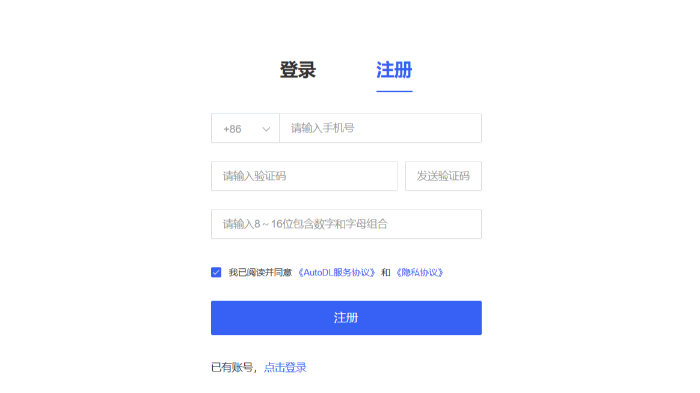
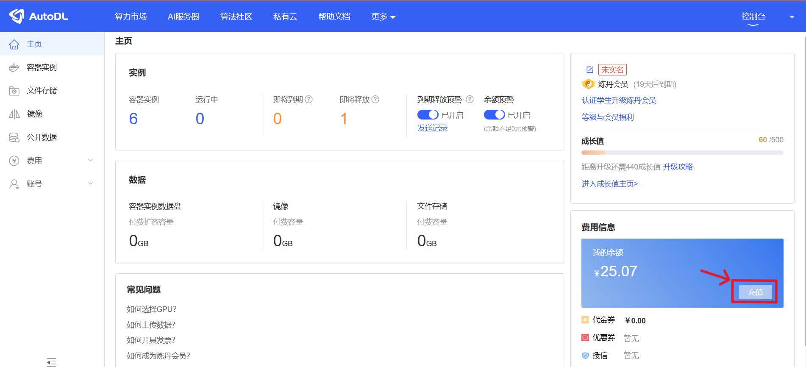
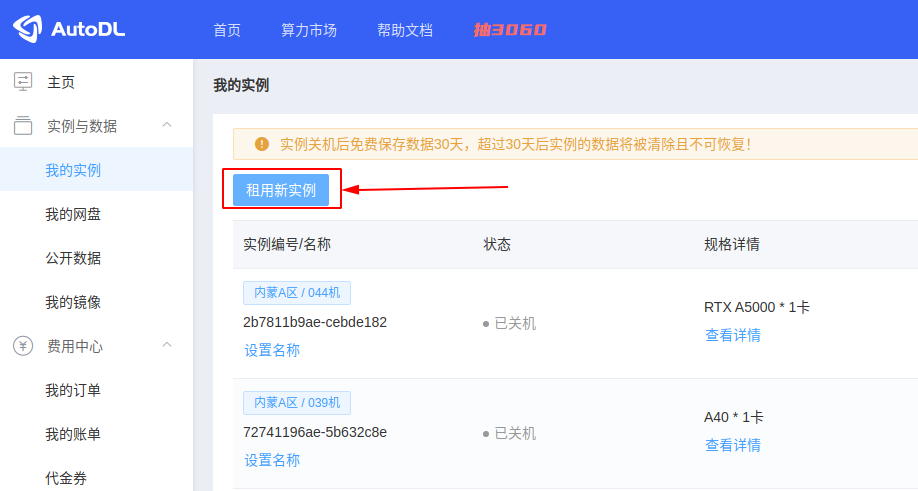
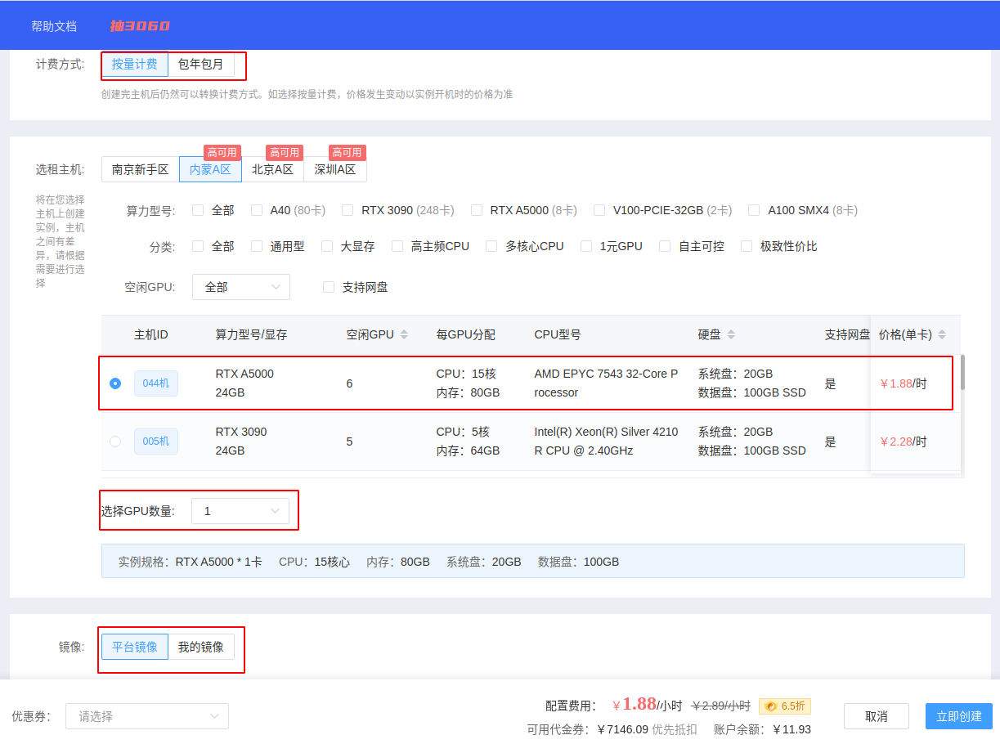
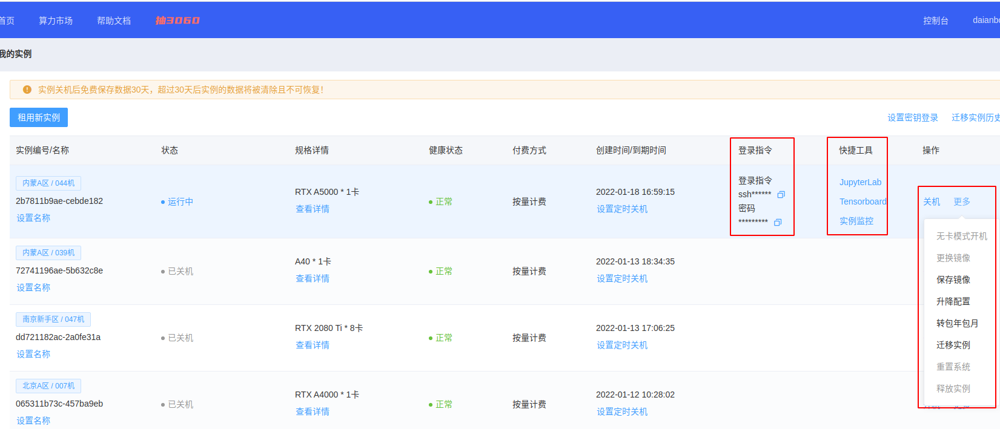
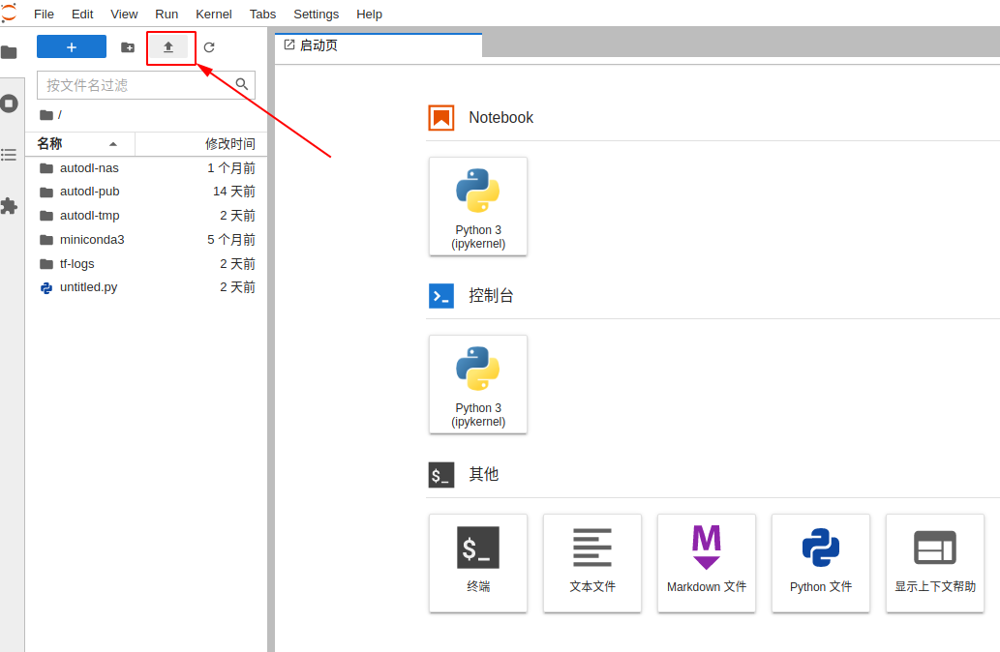
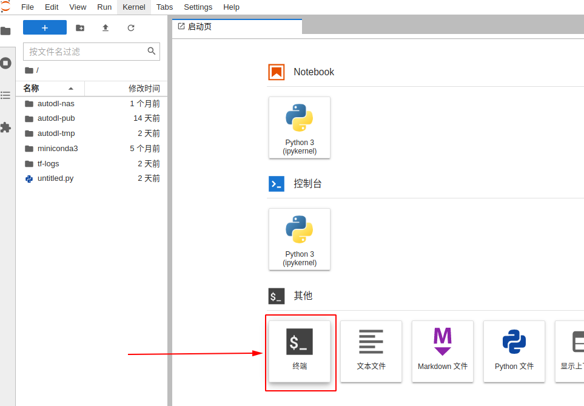
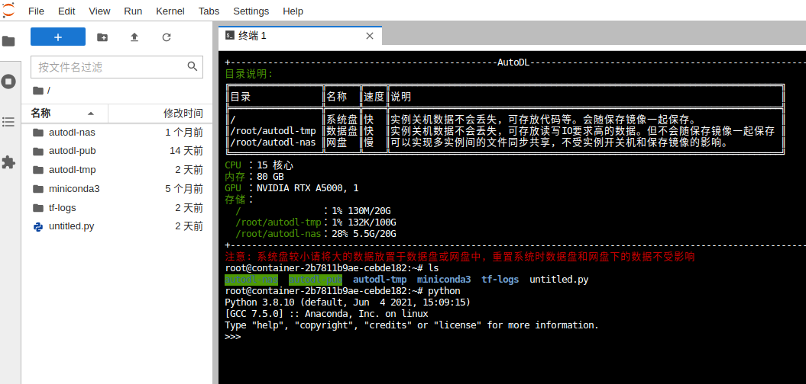

# YOLOv5 使用说明
:arrow_right:： YOLOv5 的基础教程

---

## 目录
- [YOLOv5 介绍](#yolov5-介绍)
- [安装](#安装)
    - 安装 Anaconda3
    - 搭建 YOLO 环境
    - 配置 YOLOv5
    - 配置 LabelImg
- [数据准备](#数据准备)
    - 数据获取
    - 数据增强
    - 数据标注
    - 数据校验
    - 数据分配
- [模型训练](#模型训练)
    - 本地训练
    - 线上训练
    - 结果分析
- [模型量化](#模型量化)
    - 量化工具
- [模型部署](#模型部署)
    - 模型转换

---

## YOLOv5 介绍

| 模型                                                                                             | 尺寸<br><sup>（像素） | mAP<sup>val<br>50-95 | mAP<sup>val<br>50 | 推理速度<br><sup>CPU b1<br>（ms） | 推理速度<br><sup>V100 b1<br>（ms） | 速度<br><sup>V100 b32<br>（ms） | 参数量<br><sup>(M) | FLOPs<br><sup>@640 (B) |
| ---------------------------------------------------------------------------------------------- | --------------- | -------------------- | ----------------- | --------------------------- | ---------------------------- | --------------------------- | --------------- | ---------------------- |
| [YOLOv5n](https://github.com/ultralytics/yolov5/releases/download/v7.0/yolov5n.pt)             | 640             | 28.0                 | 45.7              | **45**                      | **6.3**                      | **0.6**                     | **1.9**         | **4.5**                |
| [YOLOv5s](https://github.com/ultralytics/yolov5/releases/download/v7.0/yolov5s.pt)             | 640             | 37.4                 | 56.8              | 98                          | 6.4                          | 0.9                         | 7.2             | 16.5                   |
| [YOLOv5m](https://github.com/ultralytics/yolov5/releases/download/v7.0/yolov5m.pt)             | 640             | 45.4                 | 64.1              | 224                         | 8.2                          | 1.7                         | 21.2            | 49.0                   |
| [YOLOv5l](https://github.com/ultralytics/yolov5/releases/download/v7.0/yolov5l.pt)             | 640             | 49.0                 | 67.3              | 430                         | 10.1                         | 2.7                         | 46.5            | 109.1                  |
| [YOLOv5x](https://github.com/ultralytics/yolov5/releases/download/v7.0/yolov5x.pt)             | 640             | 50.7                 | 68.9              | 766                         | 12.1                         | 4.8                         | 86.7            | 205.7                  |
|                                                                                                |                 |                      |                   |                             |                              |                             |                 |                        |
| [YOLOv5n6](https://github.com/ultralytics/yolov5/releases/download/v7.0/yolov5n6.pt)           | 1280            | 36.0                 | 54.4              | 153                         | 8.1                          | 2.1                         | 3.2             | 4.6                    |
| [YOLOv5s6](https://github.com/ultralytics/yolov5/releases/download/v7.0/yolov5s6.pt)           | 1280            | 44.8                 | 63.7              | 385                         | 8.2                          | 3.6                         | 12.6            | 16.8                   |
| [YOLOv5m6](https://github.com/ultralytics/yolov5/releases/download/v7.0/yolov5m6.pt)           | 1280            | 51.3                 | 69.3              | 887                         | 11.1                         | 6.8                         | 35.7            | 50.0                   |
| [YOLOv5l6](https://github.com/ultralytics/yolov5/releases/download/v7.0/yolov5l6.pt)           | 1280            | 53.7                 | 71.3              | 1784                        | 15.8                         | 10.5                        | 76.8            | 111.4                  |
| [YOLOv5x6](https://github.com/ultralytics/yolov5/releases/download/v7.0/yolov5x6.pt)<br>+[TTA] | 1280<br>1536    | 55.0<br>**55.8**     | 72.7<br>**72.7**  | 3136<br>-                   | 26.2<br>-                    | 19.4<br>-                   | 140.7<br>-      | 209.8<br>-             |


优点：

缺点：

---

## 安装

- ### Anaconda 安装
    

1. 官网 [下载](https://www.anaconda.com/download)，网速慢可从清华镜像源 [下载](https://mirrors.tuna.tsinghua.edu.cn/anaconda/archive/) 并安装 Anaconda3 。

2. 打开 terminal（终端） 或者 cmd（命令行）查看版本：
    ```bash
    conda -V # 查看 Anaconda 版本
    ```
    如果出现类似于 `conda 23.7.4` 的输出说明安装成功

- ### 搭建 YOLO 环境

1. <span id="jump"></span>查看环境：
    ```bash
    conda env list # 查看 Anaconda 环境
    ```
    此时应该只存在一个 `base` 环境：
    ```bash
    # conda environments:
    #
    base                    /Users/Stewart222b/anaconda3
    ```

2. 创建新环境：
    ```bash
    conda create -n yolo # 创建 Anaconda 环境
    ```
    `-n` 为环境名称
    其中 python 版本默认为 `base` 环境中的 python 版本。如果对 python 版本有要求，可以在末尾加上 `python=3.x` （ x 为任意版本）在指令末尾
    ```bash
    conda create -n yolo python=3.8 # 创建 python 版本为 3.8 的环境
    ```
    再次查看环境，此时应新增一个 `yolo` 环境：
    ```bash
    # conda environments:
    #
    base                    /Users/Stewart222b/anaconda3
    yolo                    /Users/Stewart222b/anaconda3/envs/yolo
    ```
3. 切换到 `yolo` 环境：
    ```bash
    conda activate yolo # 切换到 yolo 环境
    ```
    执行完毕后，terminal 或者 cmd 的命令输入行左侧应出现 `(yolo)`：
    ```bash
    (yolo) Stewart222b@This-MacBook-Pro ~ % # terminal
    ```
    ```bash
    (yolo) C:\Projects> # cmd
    ```
4. 退出环境
    ```bash
    conda deactivate yolo # 退出 yolo 环境
    ```

- ### 配置 YOLOv5
1. 从 GitHub [下载](https://github.com/ultralytics/yolov5) 源码或使用 `git clone`
    ```bash
    git clone https://github.com/ultralytics/yolov5.git
    ```

2. 在 `yolo` 环境下安装所需要的库
    ```bash
    conda activate yolo
    pip install -r requirements.txt
    ```
    安装完之后就可以准备数据然后开始模型的训练了。本文档提供了一个 demo 数据集可供训练，如果想直接训练模型可以跳转到 [模型训练](#模型训练) 

---

## 数据集准备
以下为官方文档中获得最佳训练结果的建议的个人翻译，如需更准确内容请 [查看原文](https://docs.ultralytics.com/yolov5/tutorials/tips_for_best_training_results/)

>### 获得最佳训练效果的建议
>
>📚 本指南解释了如何使用 YOLOv5 生成最好的 mAP 和训练结果 🚀。更新于 2022 年 5 月 25 日。
>
> 绝大多数情况下，**只要数据集足够大且标注准确**，就可以在不改变模型或训练设置的情况下获得良好的训练结果。如果一开始没有得到好的结果，你可以采取一些步骤来改进，但我们强烈建议用户在考虑任何更改之前**先使用所有默认的设置进行训练**。这有助于找到模型性能的下限，并以此为基础发掘需要改进的点。
>
>If you have questions about your training results **we recommend you provide the maximum amount of information possible** if you expect a helpful response, including results plots (train losses, val losses, P, R, mAP), PR curve, confusion matrix, training mosaics, test results and dataset statistics images such as labels.png. All of these are located in your `project/name` directory, typically `yolov5/runs/train/exp`.
>
>We've put together a full guide for users looking to get the best results on their YOLOv5 trainings below.
>
>## 数据集
>
>- **每类图片数量。** 推荐每个类别的图片数量 **≥ 1500** 张
>- **每类实例数量。** 推荐每个类别的实例（已标注目标）数量 **≥ 10000** 个
>- **图片多样性。** Must be representative of deployed environment. For real-world use cases we recommend images from different times of day, different seasons, different weather, different lighting, different angles, different sources (scraped online, collected locally, different cameras) etc.
>- **标注一致性。** All instances of all classes in all images must be labelled. Partial labelling will not work.
>- **标注准确性。** Labels must closely enclose each object. No space should exist between an object and it's bounding box. No objects should be missing a label.
>- **Label verification.** View `train_batch*.jpg` on train start to verify your labels appear correct, i.e. see [example](https://docs.ultralytics.com/yolov5/tutorials/train_custom_data#local-logging) mosaic.
>- **背景图片。** Background images are images with no objects that are added to a dataset to reduce False Positives (FP). We recommend about 0-10% background images to help reduce FPs (COCO has 1000 background images for reference, 1% of the total). No labels are required for background images.
>
><a href="https://arxiv.org/abs/1405.0312"></a>
>
>## 模型选择
>
>像 YOLOv5x 和 [YOLOv5x6](https://github.com/ultralytics/yolov5/releases/tag/v5.0) 这样的大型模型几乎在所有情况下都会有更好的训练结果，但是，训练的时候需要更多的 CUDA 内存，并且有较慢的运行速度。对于**移动端**部署，我们推荐使用 YOLOv5s/m 。对于**云端**部署，我们推荐使用 YOLOv5l/x 。有关所有模型的完整比较，请参阅 README [表格](https://github.com/ultralytics/yolov5#pretrained-checkpoints) 。
>
><p align="center"></p>
>
>- **Start from Pretrained weights.** Recommended for small to medium-sized datasets (i.e. [VOC](https://github.com/ultralytics/yolov5/blob/master/data/VOC.yaml), [VisDrone](https://github.com/ultralytics/yolov5/blob/master/data/VisDrone.yaml), [GlobalWheat](https://github.com/ultralytics/yolov5/blob/master/data/GlobalWheat2020.yaml)). Pass the name of the model to the `--weights` argument. Models download automatically from the [latest YOLOv5 release](https://github.com/ultralytics/yolov5/releases).
>
>```shell
>python train.py --data custom.yaml --weights yolov5s.pt
>                                             yolov5m.pt
>                                             yolov5l.pt
>                                             yolov5x.pt
>                                             custom_pretrained.pt
>```
>
>- **Start from Scratch.** Recommended for large datasets (i.e. [COCO](https://github.com/ultralytics/yolov5/blob/master/data/coco.yaml), [Objects365](https://github.com/ultralytics/yolov5/blob/master/data/Objects365.yaml), [OIv6](https://storage.googleapis.com/openimages/web/index.html)). Pass the model architecture YAML you are interested in, along with an empty `--weights ''` argument:
>
>```bash
>python train.py --data custom.yaml --weights '' --cfg yolov5s.yaml
>                                                      yolov5m.yaml
>                                                      yolov5l.yaml
>                                                      yolov5x.yaml
>```
>
>## 训练设置
>
>Before modifying anything, **first train with default settings to establish a performance baseline**. A full list of train.py settings can be found in the [train.py](https://github.com/ultralytics/yolov5/blob/master/train.py) argparser.
>
>- **Epochs.** Start with 300 epochs. If this overfits early then you can reduce epochs. If overfitting does not occur after 300 epochs, train longer, i.e. 600, 1200 etc epochs.
>- **Image size.** COCO trains at native resolution of `--img 640`, though due to the high amount of small objects in the dataset it can benefit from training at higher resolutions such as `--img 1280`. If there are many small objects then custom datasets will benefit from training at native or higher resolution. Best inference results are obtained at the same `--img` as the training was run at, i.e. if you train at `--img 1280` you should also test and detect at `--img 1280`.
>- **Batch size.** Use the largest `--batch-size` that your hardware allows for. Small batch sizes produce poor batchnorm statistics and should be avoided.
>- **Hyperparameters.** Default hyperparameters are in [hyp.scratch-low.yaml](https://github.com/ultralytics/yolov5/blob/master/data/hyps/hyp.scratch-low.yaml). We recommend you train with default hyperparameters first before thinking of modifying any. In general, increasing augmentation hyperparameters will reduce and delay overfitting, allowing for longer trainings and higher final mAP. Reduction in loss component gain hyperparameters like `hyp['obj']` will help reduce overfitting in those specific loss components. For an automated method of optimizing these hyperparameters, see our [Hyperparameter Evolution Tutorial](https://docs.ultralytics.com/yolov5/tutorials/hyperparameter_evolution).
>
>## Further Reading
>
>If you'd like to know more, a good place to start is Karpathy's 'Recipe for Training Neural Networks', which has great ideas for training that apply broadly across all ML domains: [http://karpathy.github.io/2019/04/25/recipe/](http://karpathy.github.io/2019/04/25/recipe/)
>
>祝你好运🍀，如果你有任何其他问题请联系我们!

- ### 数据获取
    :triangular_flag_on_post:
- ### 数据标注
    :warning: 一定要筛查整个数据集后再确定标注的类别
    :warning: 制定一个统一的标注标准：如果为多人同时标注一个数据集，尽量使用一个标准。（举例：有车被挡住了，是只标注露出的部分还是连同被遮挡着部分一同标注）
    :triangular_flag_on_post:
- ### 数据增强
    如果想提升模型在不同场景和环境下的性能，数据增强是十分重要的。同时，数据增强可以帮我们获得额外的数据。
    :triangular_flag_on_post:
- ### 数据校验
    检查标注完的数据集中样本数量的分配，确保每个类别的样本数量不能过少。 比如 有一个要区分
    :triangular_flag_on_post:
- ### 数据分配
    训练集和验证集的比例建议为 9:1 或者 8:2 。
    
    假设现在有 1000 张数据，在其中随机抽取 200 张作为验证集。但是不能完全随机，要保证验证集涉及到训练集中的所有场景和类别。比如数据集中一共有20个类，但是验证集中却只出现了十五个类，这是十分致命的，并且会严重影响训练结果。


---

## 模型训练

demo 数据集内容：50 张哆啦A梦的图片。类别仅有 1 类：A Meng

demo 数据集在这里 [下载](https://www.aliyundrive.com/s/hz6un5Kd9T5) ，提取码：`e28r`


- ### 本地训练
    路径跳转到 `yolov5` 文件夹
    ```bash
    cd C:/projects/yolo/yolov5 # 位置修改一下
    ```
    训练命令
    ```bash
    python train.py --batch -1 --epoch 100 --weights yolov5s.pt --data ./data/A.yaml
    ```
    `--batch`：每一批训练的图片数量
    `--epoch`：训练轮数
    `--weights` ：训练权重
    `--data`：训练数据

    `train.py`中的所有参数
    ```bash
    if __name__ == '__main__':
    check_git_status()
    parser = argparse.ArgumentParser()
    parser.add_argument('--cfg', type=str, default='models/yolov5s.yaml', help='model.yaml path')
    parser.add_argument('--data', type=str, default='data/coco128.yaml', help='data.yaml path')
    parser.add_argument('--hyp', type=str, default='', help='hyp.yaml path (optional)')
    parser.add_argument('--epochs', type=int, default=300)
    parser.add_argument('--batch-size', type=int, default=16)
    parser.add_argument('--img-size', nargs='+', type=int, default=[640, 640], help='train,test sizes')
    parser.add_argument('--rect', action='store_true', help='rectangular training')
    parser.add_argument('--resume', nargs='?', const='get_last', default=False,
                        help='resume from given path/to/last.pt, or most recent run if blank.')
    parser.add_argument('--nosave', action='store_true', help='only save final checkpoint')
    parser.add_argument('--notest', action='store_true', help='only test final epoch')
    parser.add_argument('--noautoanchor', action='store_true', help='disable autoanchor check')
    parser.add_argument('--evolve', action='store_true', help='evolve hyperparameters')
    parser.add_argument('--bucket', type=str, default='', help='gsutil bucket')
    parser.add_argument('--cache-images', action='store_true', help='cache images for faster training')
    parser.add_argument('--weights', type=str, default='', help='initial weights path')
    parser.add_argument('--name', default='', help='renames results.txt to results_name.txt if supplied')
    parser.add_argument('--device', default='', help='cuda device, i.e. 0 or 0,1,2,3 or cpu')
    parser.add_argument('--multi-scale', action='store_true', help='vary img-size +/- 50%%')
    parser.add_argument('--single-cls', action='store_true', help='train as single-class dataset')
    opt = parser.parse_args()
    ```

- ### 线上训练
    除了在自己的设备上训练，也可以在服务器上来训练模型。一些线上训练的优缺点：
    - 优点：
        - 速度快：服务器上的显卡大多性能强大、算力高，如 RTX4090 等。
        - 不占资源：线上训练不影响本地设备的性能。
    - 缺点：
        - 收费：需要花钱租用显卡，费用大概几块钱一小时。
        - 时间受限：在高峰期可能出现没有显卡的情况。

    <br>

    以一个平台 [AutoDL算力云](https://www.autodl.com/home) 为例，介绍一下使用流程：
    > [注册账号](#注册账号) :arrow_right: [租用显卡](#租用显卡) :arrow_right: [上传数据](#上传数据) :arrow_right: [开始训练](#开始训练)

1. 注册账号：<span id="注册账号"></span>
    - 打开网站后在页面右上角点击 `立即注册` 来注册账号。
    
    - 注册完成后进入控制台，在费用信息下，点击 `充值` 。
    
    

3. 租用显卡：<span id="租用显卡"></span>

    - 充值完成后再次进入控制台，在我的实例菜单下，点击 `租用新实例` 。
    
    - 在租用实例页面：选择计费方式，选择合适的主机，选择要创建实例中的GPU数量，选择镜像（内置了不同的深度学习框架），最后创建即可。
    
    - 创建完成后等待开机，今后主要用到的操作入口见截图中。
    
4. 上传数据: <span id="上传数据"></span>
    - 开机后在这个正在运行中的实例上找到快捷工具：JupyterLab，点击打开，在下面的截图中找到上传按钮，即可上传数据。
    
    :warning:：默认仅支持文件传输，因此需要将 yolov5 和 envs 文件夹压缩之后再进行上传。如想上传文件夹或更高级的方式请查阅 [上传数据文档](https://www.autodl.com/docs/scp/) 。
5. 开始训练：<span id="开始训练"></span>
    - 在打开的JupyterLab页面中打开终端。
    
    - 在终端界面执行指令来开始训练。
    
    建议在训练指令后面加入 `shutdown` 命令，可使实例在训练结束后自动关机。:triangular_flag_on_post:

- ### 结果分析
    检测指令
    ```bash
    python detect.py --weights ./runs/train/exp2/weights/best.pt --img 640 --conf 0.25 --source ../test2.jpg --save-txt
    ```
    :triangular_flag_on_post:
---

## 模型量化

- ### 量化工具
    导出为 onnx 格式
    ```bash
    python export.py
    ```
    :triangular_flag_on_post:

---

## 模型部署

- ### 模型转换


---