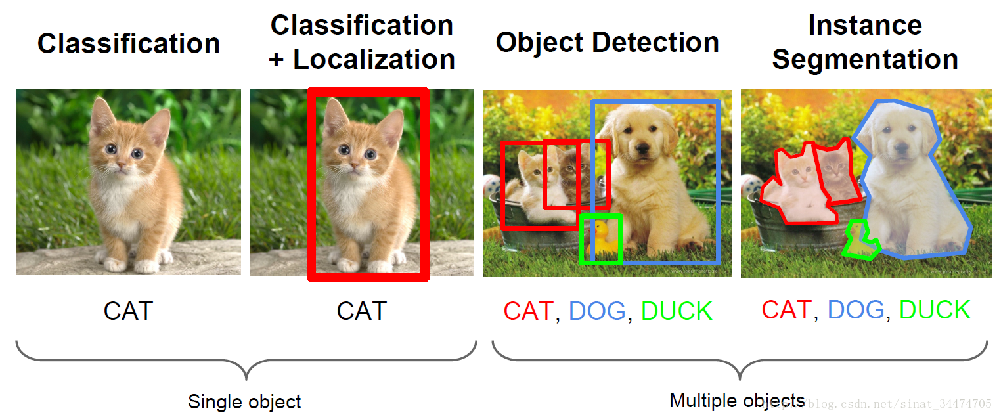
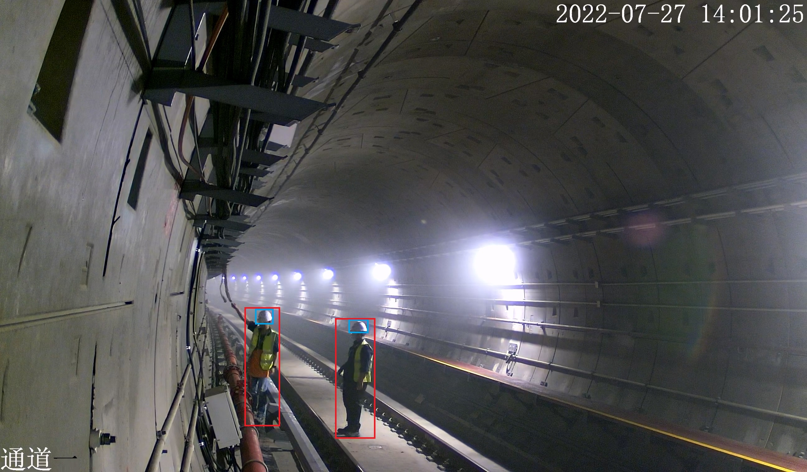
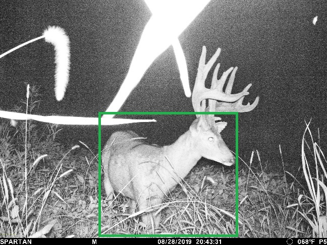
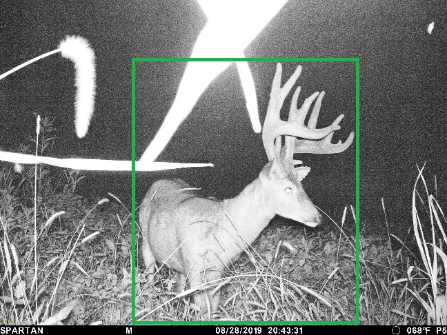
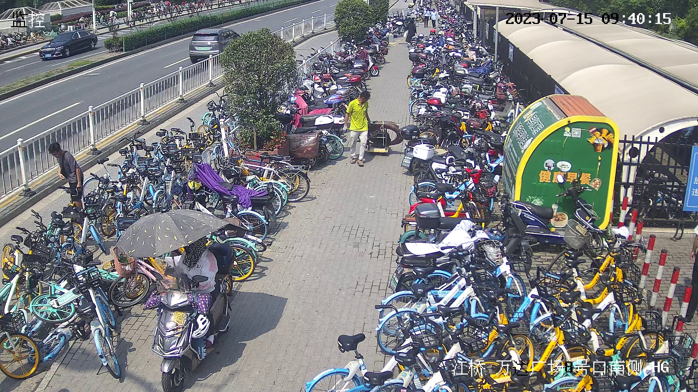
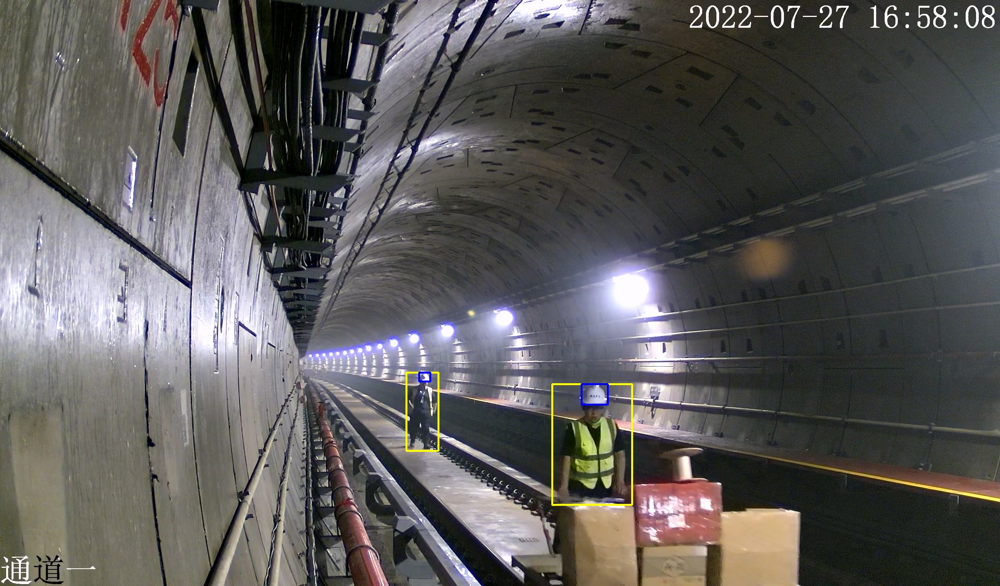
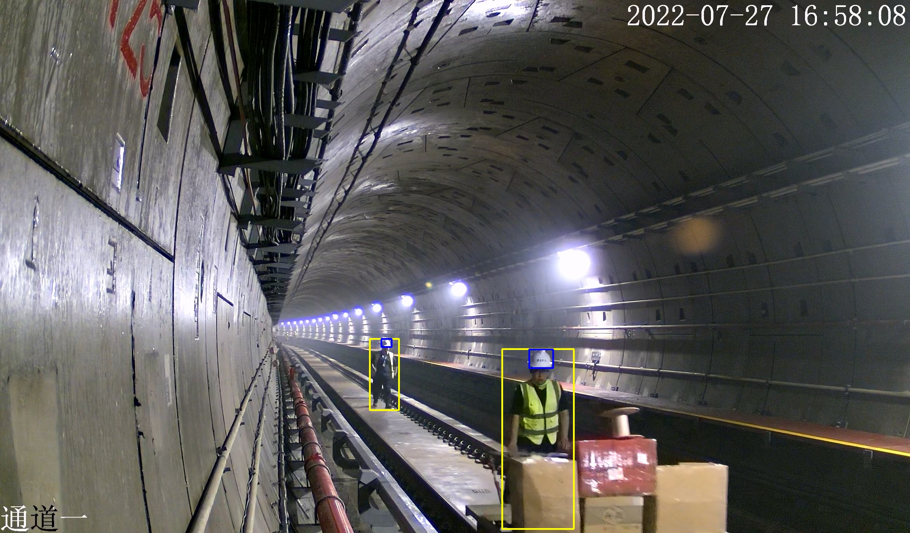

# YOLOv5 使用说明
:arrow_right:： YOLOv5 的基础教程

---

## 目录
- [YOLOv5 介绍](#yolov5-介绍)
- [安装](#安装)
    - [安装 Anaconda3](#anaconda-安装)
    - [搭建 YOLO 环境](#搭建-yolo-环境)
    - [配置 YOLOv5](#配置-yolov5)
    - 配置 LabelImg
- [数据准备](#数据准备)
    - 数据获取
    - 数据增强
    - 数据标注
    - 数据校验
    - 数据分配
- [模型训练](#模型训练)
    - 本地训练
    - 线上训练
    - 结果分析
- [模型量化](#模型量化)
    - 量化工具
- [模型部署](#模型部署)
    - 模型转换

---

## YOLOv5 介绍


上面这张图很好的概括了计算机视觉（Computer Vision）中图像识别技术的四类任务：

图像分类（Image Classification）
:arrow_down:
图像分类 + 定位（Image Classification + Localization）
:arrow_down:
目标检测（Object Detection）
:arrow_down:
实例分割（Instance Segmentation）

这四类任务的难度呈递进关系，实例分割是功能最强大但难度最高的任务，虽然其功能强大，但一般项目的硬件并不能支撑模型的运行。相比之下，目标检测模型则在保证了其功能的情况下不需要很强大的性能来运行。

近几年来，目标检测算法取得了很大的突破。比较流行的算法可以分为两类：
- 一类是基于Region Proposal 的 R-CNN 系算法（R-CNN，Fast R-CNN, Faster R-CNN），它们是 **two-stage** 的算法，需要先使用启发式方法（selective search）或者 CNN 网络（RPN）产生 Region Proposal，然后再在 Region Proposal 上做分类与回归。
- 而另一类是 YOLO，SSD 这类 **one-stage** 算法，其仅仅使用一个 CNN 网络直接预测不同目标的类别与位置。

第一类方法是**准确度高一些，但是速度慢**。第二类算法是**速度快，但是准确性要低一些**。YOLO 是一个单阶段目标检测算法，其全称是 You Only Look Once: Unified, Real-Time Object Detection 。You Only Look Once 说的是只需要一次 CNN 运算，Unified 指的是这是一个统一的框架，提供end-to-end的预测，而 Real-Time 体现的是 YOLO 算法速度快。


优点：训练快，推理快，部署方便，有各种尺寸的模型

缺点：不擅长小目标检测，对于实例很少的类别识别能力差

---

## 安装

### Anaconda 安装

Anaconda 官网 [下载](https://www.anaconda.com/download)，网速慢可从清华镜像源 [下载](https://mirrors.tuna.tsinghua.edu.cn/anaconda/archive/) 并安装 Anaconda3 。

### 搭建 YOLO 环境

#### 1. <span id="jump"></span>查看环境
```bash {.line-numbers}
conda env list # 查看 Anaconda 环境
```
此时应该只存在一个 `base` 环境：
```bash {.line-numbers}
# conda environments:
#
base                    /Users/Stewart222b/anaconda3
```

#### 2. 创建新环境
```bash {.line-numbers}
conda create -n yolo # 创建 Anaconda 环境
```
其中 python 版本默认为 `base` 环境中的 python 版本。如果对 python 版本有要求，可以在末尾加上 `python=3.x` （ x 为任意版本）在指令末尾
```bash {.line-numbers}
conda create -n yolo python=3.8 # 创建 python 版本为 3.8 的环境
```
再次查看环境，此时应新增一个 `yolo` 环境：
```bash {.line-numbers}
# conda environments:
#
base                    /Users/Stewart222b/anaconda3
yolo                    /Users/Stewart222b/anaconda3/envs/yolo
```
#### 3. 切换到 `yolo` 环境
```bash {.line-numbers}
conda activate yolo # 切换到 yolo 环境
```
执行完毕后，terminal 或者 cmd 的命令输入行左侧应出现 `(yolo)`：
```bash {.line-numbers}
(yolo) Stewart222b@This-MacBook-Pro ~ % # terminal
(yolo) C:\Projects> # cmd
```
#### 4. 退出环境
```bash {.line-numbers}
conda deactivate yolo # 退出 yolo 环境
```

### 配置 YOLOv5
#### 1. 下载
从 GitHub [下载](https://github.com/ultralytics/yolov5) 源码或使用 `git clone`
```bash {.line-numbers}
git clone https://github.com/ultralytics/yolov5.git
```

#### 2. 安装
在 `yolo` 环境下安装所需要的库
```bash {.line-numbers}
conda activate yolo
pip install -r requirements.txt
```
安装完之后就可以准备数据了。本文档提供了一个 demo 数据集可供训练，如果想直接训练模型可以跳转到 [模型训练](#模型训练) 

---

>
## 数据集准备
以下为官方文档中获得最佳训练结果的建议的翻译，如需更准确内容请 [查看原文](https://docs.ultralytics.com/yolov5/tutorials/tips_for_best_training_results/)

>### 获得最佳训练效果的建议
>
>📚 本指南解释了如何使用 YOLOv5 生成最好的 mAP 和训练结果 🚀。更新于 2022 年 5 月 25 日。
>
> 绝大多数情况下，**只要数据集足够大且标注准确**，就可以在不改变模型或训练设置的情况下获得良好的训练结果。如果一开始没有得到好的结果，你可以采取一些步骤来改进，但我们强烈建议用户在考虑任何更改之前**先使用所有默认的设置进行训练**。这有助于找到模型性能的下限，并以此为基础发掘需要改进的点。
>
>如果您对您的训练结果有疑问并且希望得到有帮助的回复，**我们建议您提供尽可能多的信息**，包括结果图（训练损失，val 损失，P，R，mAP），PR曲线，混淆矩阵，训练马赛克，测试结果和数据集统计图像，如 labels.png 。所有这些关于训练结果的数据通常都存放在 `yolov5/runs/train/exp` 路径中。
>
>我们在下面为希望获得 YOLOv5 最佳训练结果的用户提供了完整的指南。
>
>### 数据集
>
>- **每类图像数量。** 推荐每个类别的图像数量 **≥ 1500** 张
>- **每类实例数量。** 推荐每个类别的实例（已标注目标）数量 **≥ 10000** 个
>- **图像多样性。** 必须囊括要部署的环境。假设一个模型用于现实世界中，我们推荐使用多种多样的图像来训练，这些多样性由以下因素体现：不同时间、不同季节、不同天气、不同照明、不同角度、不同来源（在线抓取、本地采集、不同相机）。
>- **标注一致性。** 所有图像中所有类别的所有实例都必须做标注。不可以只标注一部分。
>- **标注准确性。** 标注必须紧贴目标。每个目标和它边界框之间不应该有空隙。任何目标都不应该缺少标注。
>- **Label verification.** View `train_batch*.jpg` on train start to verify your labels appear correct, i.e. see [example](https://docs.ultralytics.com/yolov5/tutorials/train_custom_data#local-logging) mosaic.
>- **背景图像。**  背景图像是没有目标的图像，它们被添加到数据集中以减少假阳（False Positive (FP)）。我们建议使用 0-10% 的背景图像来帮助降低 FPs（COCO 数据集有 1000 张背景图像作为参考，占总数的 1%）。背景图像不需要做标注。
>
><a href="https://arxiv.org/abs/1405.0312"></a>
>
>### 模型选择
>
>像 YOLOv5x 和 [YOLOv5x6](https://github.com/ultralytics/yolov5/releases/tag/v5.0) 这样的大型模型几乎在所有情况下都会有更好的训练结果，但是它们有更多的参数，训练的时候需要更多的 CUDA 内存，并且有较慢的运行速度。对于**移动端**部署，我们推荐使用 YOLOv5s/m 。对于**云端**部署，我们推荐使用 YOLOv5l/x 。有关所有模型的完整比较，请参阅 README [表格](https://github.com/ultralytics/yolov5#pretrained-checkpoints) 。
>
><p align="center"></p>
>
>- **使用预训练的模型权重开始训练。** 推荐用于中小型数据集（如 [VOC](https://github.com/ultralytics/yolov5/blob/master/data/VOC.yaml), [VisDrone](https://github.com/ultralytics/yolov5/blob/master/data/VisDrone.yaml), [GlobalWheat](https://github.com/ultralytics/yolov5/blob/master/data/GlobalWheat2020.yaml)）。将模型的名称传递给 `--weights` 参数。如果权重模型不在 `cwd` 中将自动从 [最新的 YOLOv5 版本](https://github.com/ultralytics/yolov5/releases) 下载。
>
>```shell
>python train.py --data custom.yaml --weights yolov5s.pt
>                                             yolov5m.pt
>                                             yolov5l.pt
>                                             yolov5x.pt
>                                             custom_pretrained.pt
>```
>
>- **从零开始（不使用模型权重开始训练）。** 推荐用于大型数据集（如 [COCO](https://github.com/ultralytics/yolov5/blob/master/data/coco.yaml)，[Objects365](https://github.com/ultralytics/yolov5/blob/master/data/Objects365.yaml)，[OIv6](https://storage.googleapis.com/openimages/web/index.html)）。 传递你感兴趣的模型架构 `yaml` 文件，以及一个空的权重参数 `--weights ''`：
>
>```bash
>python train.py --data custom.yaml --weights '' --cfg yolov5s.yaml
>                                                      yolov5m.yaml
>                                                      yolov5l.yaml
>                                                      yolov5x.yaml
>```
>
>### 训练设置
>
>在修改任何内容之前，**首先使用默认设置进行训练**，以找到模型性能的基准线。[train.py](https://github.com/ultralytics/yolov5/blob/master/train.py) 设置的完整列表可以在 train.py 参数解析器中找到。
>
>- **轮数（Epoch）。** 从 300 轮开始训练。如果过拟合（overfitting）出现较早，则可以减少epoch。如果在 300 轮之后没有出现过拟合，那么就训练更长的时间，比如 600 轮、1200 轮等。
>- **图像大小（Image size）。** 虽然 COCO 数据集中有大量的小对象并且可以从更高分辨率（如 `--img 1280`）的训练中受益，但是 COCO 还是以 `--img 640` 的原生分辨率进行训练（注：可能为了训练速度，YOLOv5 训练使用的 COCO2017 有超过 14 万张有标注的图片）。如果您的数据集中有许多小目标，那么使用更高分辨率的训练将会产生更好的训练结果。如果您在 `--img 1280` 分辨率下进行训练，那么您也应该在 `--img 1280` 下进行测试和检测。使用相同的分辨率才能获得最佳的推理结果。
>- **批次大小（Batch size）。** 请使用硬件允许的最大 `--batch-size` 。小批量训练会产生较差的批量统计数据（batchnorm statistics），应该避免。
>- **超参数（Hyperparameters）。** 默认的超参数在 [hyp.scratch-low.yaml](https://github.com/ultralytics/yolov5/blob/master/data/hyps/hyp.scratch-low.yaml) 中。我们建议您在考虑修改任何默认超参数之前先使用默认超参数进行训练。通常，增加增强超参数（augmentation hyperparameter）将减少和延迟过拟合，从而允许更长的训练时间和更高的最终mAP。减少损失分量增益超参数（loss component gain hyperparameters）（如 `hyp['obj']`）将有助于减少这些特定损失分量的过拟合。有关优化这些超参数的自动化方法，请参阅我们的 [超参数进化教程](https://docs.ultralytics.com/yolov5/tutorials/hyperparameter_evolution).
>
>### 延伸阅读
>
>如果你想了解更多，Karpathy 的 'Recipe for Training Neural Networks' 是一个很好的开始，其中有很好的训练想法，广泛应用于所有 ML 领域：[http://karpathy.github.io/2019/04/25/recipe/](http://karpathy.github.io/2019/04/25/recipe/)
>
>祝你好运🍀，如果你有任何其他问题请联系我们!


### 1. 数据获取
通常由客户提供数据。
例如 `非机动车项目`和 `狩猎相机项目` 分别提供了 1000 张和 5000 张左右的图像。

### 2. 确定类别
#### 客户给定类别：
以 `非机动车项目` 为例，客户要求识别出非机动车并判断是否停放在禁停位置。因非机动车多为两轮车，故将自行车、电瓶车等合并为 `bicycle` 类，共 `1` 类。
#### 边标注边增加类别：
以 `狩猎相机项目` 为例，客户的部分要求为识别出数种动物。因无法确定有多少种动物，故在标注开始时设置几个客户要求的动物类别，并在标注过程中添加出现的动物类别，共 `22` 类。
#### 浏览整个数据集后根据内容确定类别：
当数据集比较小时可以使用，如 1000 张以内的数据集。

### 3. 数据分配
整个数据集**随机**分为**训练集**和**验证集**，数据充足的情况可以在增加一个**测试集**用来测试。

- 训练集和验证集的比例**建议为 9:1 或者 8:2**
- 训练集文件夹名字通常为 `train`
- 验证集文件名字通常为 `val`
- `train` 和 `val` 文件夹下各有两个文件夹：`images` 和 `labels`

格式样例：
```
# xxx_dataset
# ├── train
# |     └── images
# |     └── labels
# └── val
#       └── images
#       └── labels
```
:warning:：格式很重要，格式对了 YOLO 才能正确检测到**图像文件**和其对应**标注文件**

### 4. 标注标准
#### 标注边框必须在大于目标边界（不涉及被遮挡目标）：
以下举出两个项目中的例子
- `青岛地铁项目` 中的错误标注：

上图中共标注了两个类别 `person`（人）和 `helmet`（头盔）。标注问题：其中左一人物的 `person` 的标注边框并未将伸出去的手臂包括在内。这样标注会导致训练出的模型在人物做出动作时仍只识别其躯干。
正确标注：

- `狩猎相机项目` 中的错误标注：

上图中共标注了一个类别 `deer`（鹿）。标注问题：标注边框并未将鹿的角包括在内。这样标注会导致训练出的模型在识别鹿的时候忽略鹿角。
正确标注：


#### 尽量标注每张图中所有的目标：
YOLO 官方给的建议是标注出所有目标，但是在实际标注的时候不能完全遵守。

如果客户发来的数据场景与实际的

可以用下面这张图片来解释


假设现在有 20 个类别要标注，`非机动车` 为其中的一类。因为现在有很多个类别要区分，即使这张图中有很多的非机动车，但因为辨识度太差，只能标注出其中较清楚的几辆。

在类别很少但是目标很密集的情况（比如 `非机动车项目` 只有 1 个 `bicycle` 类），必须标注出所有的目标，即使很多目标被大幅度遮挡，也要标注出来，否则识别效果非常不理想

#### 被遮挡目标的用统一的标注方法：
`青岛地铁项目` 例图

第一种标注

第二种标注

上两图中共标注了两个类别 `person`（人）和 `helmet`（头盔）。两张图片的标注区别主要在于右一人物的 `person` 类标注的位置。第一张图只标注了未被遮挡的部分，而第二张图则同时标注了未被遮挡的部分和被遮挡的部分。**这两种标注方法都没有问题，但是在一个数据集中一定要只采用一种方法而不能多种方法来回使用**。
### 5. 标注数据
可在线标注或使用标注工具 labelImg 进行标注。
#### 在线标注：
YOLO 官方推荐的标注平台：[Roboflow](https://roboflow.com/annotate)
:warning: 由于项目数据大多保密，项目数据不推荐在线标注

#### labelImg 标注：
labelImg 官网 [下载](https://github.com/HumanSignal/labelImg)（打包好的版本 [下载]()）

使用教程：[LabelImg（目标检测标注工具）的安装与使用教程](https://blog.csdn.net/knighthood2001/article/details/125883343)

### 6. 数据校验
YOLO 官方建议每个类别有超过 **1000** 个实例，但实际情况根据数据集大小来决定。

#### 检查每个类别实例（标签）数量
```python {.line-numbers}
# 项目名称：Hunt Camera
# 程序内容：统计数据集各类别标签数量
import os
# 类别
#classes = open(os.path.dirname(__file__) + "/classes.txt", mode='r').read().rstrip("\n").split("\n") # 获取数据集类别
classes = ['Human',
        'Vehicle',
        'License plate',
        'Deer',
        'Antler',
        'Turkey',
        'Eagle',
        'Hog',
        'Bird',
        'Bear',
        'Raccoon',
        'Lynx',
        'Wolf',
        'Fox',
        'Dog',
        'Goat',
        'Tiger',
        'Squirrel',
        'Groundhog',
        'Cattle',
        'Rabbit',
        'Armadillo']
num_class = len(classes)
# 路径
path = 'C:/Projects/hunt_camera/dataset_10_16/val/labels/'
# 文件列表
files = []
for file in os.listdir(path):
    if file.endswith(".txt"):
        files.append(path+file)
# 逐文件读取
inst_count = [0 for _ in range(num_class)]
file_count = 0
for file in files:
    with open(file, 'r') as f:
        data = f.read()
        instances = data.strip("\n").split("\n") if len(data) > 0 else "" # 获取所有样本并归类
        if len(instances) <= 0:
            continue
        else:
            file_count += 1
        
        for instance in instances:
            inst_count[int(instance.split()[0])] += 1
# 输出统计结果
print("统计完成！\n    该数据集共有 " + str(num_class) + " 类\n    一共有 " + str(file_count) + " 张有实例的图片")
print("输出格式：[class: number of instances]")
result = {}
for i in range(num_class):
    result[classes[i]] = inst_count[i]
result = sorted(result.items(), key=lambda x:x[1], reverse=True)
bad_class = []
for res in result:
    print("    " + res[0] + ": " + str(res[1]))
    if res[1] < 50: bad_class.append(res[0])

print("！以下类别实例过少，建议提升实例数量\n    ", end="")
print(bad_class)
```
上面这段代码统计了 `狩猎相机` 数据集中训练集各个类别的实例数量，输出如下
```bash {.line-numbers}
统计完成！
    该数据集共有 22 类
    一共有 4598 张有样本的图片
输出格式：[class: number of instances]
    Deer: 3837
    Antler: 1499
    Turkey: 800
    Bird: 284
    Raccoon: 270
    Goat: 262
    Human: 239
    Hog: 209
    Lynx: 185
    Cattle: 179
    Fox: 144
    Wolf: 142
    Vehicle: 122
    Dog: 121
    Eagle: 117
    Bear: 110
    Armadillo: 94
    Squirrel: 93
    Rabbit: 74
    Groundhog: 58
    Tiger: 55
    License plate: 8
！以下类别实例过少，建议提升实例数量
    ['License plate']
```
设定的警告值为小于 50 ，数据集中的 `License plate` （车牌）类别被警告实例数量过少。

### 7. 数据补充
可通过不同方法补充新的数据来

#### 客户提供
如果客户可以提供更多样的数据，对模型识别的精度和广度有很大提升
- 以 `青岛地铁项目` 为例，一开始并没有类别 `train`（火车）的数据导致识别效果很差。但随着地铁试运行后获得很多新数据，使得模型对 `train` 的识别精度提升很大

#### 网络搜索
如果客户不能提供更多数据，可以自行在网络上搜索新的数据
- 以 `非机动车项目` 为例，数据集中有非常多的堆叠自行车，但却几乎没有完整/不被遮挡的自行车，因此需要自行添加一些高质量的自行车图像

#### 数据增强（Data Augmentation）
**定义**：数据增强也叫数据扩增，意思是在不实质性的增加数据的情况下，让有限的数据产生等价于更多数据的价值
关于数据增强的介绍:[【机器学习】数据增强(Data Augmentation)](https://blog.csdn.net/u010801994/article/details/81914716)

虽然数据增强通常可以借助现有数据产生许多新的数据，但在 YOLOv5 中，数据增强是在训练过程中进行的，并不会实质性的产生新数据，因此需要在训练之前调整相关函数或直接在训练时修改关于数据增强的超参数。

**修改代码来调整数据增强**：[YOLOv5 使用的数据增强方法汇总](https://blog.csdn.net/weixin_44751294/article/details/126211751)


---

## 模型训练

demo 数据集内容：50 张哆啦A梦的图片。类别仅有 1 类：A Meng

demo 数据集在这里 [下载](https://www.aliyundrive.com/s/hz6un5Kd9T5) ，提取码：`e28r`


### 本地训练
路径跳转到 `yolov5` 文件夹
```bash
cd C:/projects/yolo/yolov5 # 位置修改一下
```
训练命令
```bash
python train.py --batch -1 --epoch 100 --weights yolov5s.pt --data ./data/A.yaml
```
`--batch`：每一批训练的图片数量
`--epoch`：训练轮数
`--weights` ：训练权重
`--data`：训练数据

以下为 `train.py` 中的所有参数
```python {.line-numbers}
def parse_opt(known=False):
    parser = argparse.ArgumentParser()
    parser.add_argument('--weights', type=str, default=ROOT / 'yolov5s.pt', help='initial weights path')
    parser.add_argument('--cfg', type=str, default='', help='model.yaml path')
    parser.add_argument('--data', type=str, default=ROOT / 'data/coco128.yaml', help='dataset.yaml path')
    parser.add_argument('--hyp', type=str, default=ROOT / 'data/hyps/hyp.scratch-low.yaml', help='hyperparameters path')
    parser.add_argument('--epochs', type=int, default=100, help='total training epochs')
    parser.add_argument('--batch-size', type=int, default=16, help='total batch size for all GPUs, -1 for autobatch')
    parser.add_argument('--imgsz', '--img', '--img-size', type=int, default=640, help='train, val image size (pixels)')
    parser.add_argument('--rect', action='store_true', help='rectangular training')
    parser.add_argument('--resume', nargs='?', const=True, default=False, help='resume most recent training')
    parser.add_argument('--nosave', action='store_true', help='only save final checkpoint')
    parser.add_argument('--noval', action='store_true', help='only validate final epoch')
    parser.add_argument('--noautoanchor', action='store_true', help='disable AutoAnchor')
    parser.add_argument('--noplots', action='store_true', help='save no plot files')
    parser.add_argument('--evolve', type=int, nargs='?', const=300, help='evolve hyperparameters for x generations')
    parser.add_argument('--bucket', type=str, default='', help='gsutil bucket')
    parser.add_argument('--cache', type=str, nargs='?', const='ram', help='image --cache ram/disk')
    parser.add_argument('--image-weights', action='store_true', help='use weighted image selection for training')
    parser.add_argument('--device', default='', help='cuda device, i.e. 0 or 0,1,2,3 or cpu')
    parser.add_argument('--multi-scale', action='store_true', help='vary img-size +/- 50%%')
    parser.add_argument('--single-cls', action='store_true', help='train multi-class data as single-class')
    parser.add_argument('--optimizer', type=str, choices=['SGD', 'Adam', 'AdamW'], default='SGD', help='optimizer')
    parser.add_argument('--sync-bn', action='store_true', help='use SyncBatchNorm, only available in DDP mode')
    parser.add_argument('--workers', type=int, default=8, help='max dataloader workers (per RANK in DDP mode)')
    parser.add_argument('--project', default=ROOT / 'runs/train', help='save to project/name')
    parser.add_argument('--name', default='exp', help='save to project/name')
    parser.add_argument('--exist-ok', action='store_true', help='existing project/name ok, do not increment')
    parser.add_argument('--quad', action='store_true', help='quad dataloader')
    parser.add_argument('--cos-lr', action='store_true', help='cosine LR scheduler')
    parser.add_argument('--label-smoothing', type=float, default=0.0, help='Label smoothing epsilon')
    parser.add_argument('--patience', type=int, default=100, help='EarlyStopping patience (epochs without improvement)')
    parser.add_argument('--freeze', nargs='+', type=int, default=[0], help='Freeze layers: backbone=10, first3=0 1 2')
    parser.add_argument('--save-period', type=int, default=-1, help='Save checkpoint every x epochs (disabled if < 1)')
    parser.add_argument('--seed', type=int, default=0, help='Global training seed')
    parser.add_argument('--local_rank', type=int, default=-1, help='Automatic DDP Multi-GPU argument, do not modify')

    # Logger arguments
    parser.add_argument('--entity', default=None, help='Entity')
    parser.add_argument('--upload_dataset', nargs='?', const=True, default=False, help='Upload data, "val" option')
    parser.add_argument('--bbox_interval', type=int, default=-1, help='Set bounding-box image logging interval')
    parser.add_argument('--artifact_alias', type=str, default='latest', help='Version of dataset artifact to use')

    return parser.parse_known_args()[0] if known else parser.parse_args()
```

### 线上训练
除了在自己的设备上训练，也可以在服务器上来训练模型。一些线上训练的优缺点：
- 优点：
    - 速度快：服务器上的显卡大多性能强大、算力高，如 RTX4090 等。
    - 不占资源：线上训练不影响本地设备的性能。
- 缺点：
    - 收费：需要花钱租用显卡，费用大概几块钱一小时。
    - 时间受限：在高峰期可能出现没有显卡的情况。

平台：[AutoDL算力云](https://www.autodl.com/home)
教程：[快速开始](https://www.autodl.com/docs/quick_start/)

### 结果分析
检测指令
```bash
python detect.py --weights ./runs/train/exp2/weights/best.pt --img 640 --conf 0.25 --source ../test2.jpg --save-txt
```
:triangular_flag_on_post:

---

## 模型量化

### 量化工具
导出为 onnx 格式
```bash
python export.py
```

---

## 模型部署

### 模型转换
使用对应 SDK/NDK 来转换模型

---