# YOLOv5 使用说明
## 目录
- [YOLOv5 介绍](#yolov5-介绍)
- [安装](#安装)
    - [Anaconda 安装](#anaconda-安装)
    - [搭建 YOLO 环境](#搭建-yolo-环境)
    - [配置 YOLOv5](#配置-yolov5)
- [数据集准备](#数据集准备)
    - [1. 获取数据](#1-获取数据)
    - [2. 确定类别](#2-确定类别)
    - [3. 分配数据](#3-分配数据)
    - [4. 标注标准](#4-标注标准)
    - [5. 标注数据](#5-标注数据)
    - [6. 校验数据](#6-校验数据)
    - [7. 增加数据](#7-增加数据)
- [模型训练](#模型训练)
    - [本地训练](#本地训练)
    - [线上训练](#线上训练)
    - [训练结果](#训练结果)
- [模型检测](#模型检测)
- [模型量化](#模型量化)
    - [模型导出](#模型导出)
    - [模型查看](#模型查看)
    - [量化工具](#量化工具)
    - [模型量化精度对比](#模型量化精度对比)

---

## YOLOv5 介绍


上图概括了计算机视觉（Computer Vision）中图像识别技术的四类任务：

图像分类（Image Classification）  
:arrow_down:  
图像分类 + 定位（Image Classification + Localization）  
:arrow_down:  
目标检测（Object Detection） 
:arrow_down:  
实例分割（Instance Segmentation）  

这四类任务的难度呈递进关系，实例分割是功能最强大但难度最高的任务，虽然其功能强大，但一般项目的硬件并不能支撑模型的运行。相比之下，目标检测模型则在保证了其功能的情况下不需要很强大的性能来运行。

近几年比较流行的算法可以分为两类：  
- 一类是基于Region Proposal 的 R-CNN 系算法（R-CNN，Fast R-CNN, Faster R-CNN），它们是 **two-stage** 的算法，需要先使用启发式方法（selective search）或者 CNN 网络（RPN）产生 Region Proposal，然后再在 Region Proposal 上做分类与回归。
- 而另一类是 YOLO，SSD 这类 **one-stage** 算法，其仅仅使用一个 CNN 网络直接预测不同目标的类别与位置。

第一类方法是**准确度高一些，但速度慢**。第二类算法是**速度快，但准确度低一些**。YOLO 是一个单阶段目标检测算法，其全称是 You Only Look Once: Unified, Real-Time Object Detection 。You Only Look Once 说的是只需要一次 CNN 运算，Unified 指的是这是一个统一的框架，提供end-to-end的预测，而 Real-Time 体现的是 YOLO 算法速度快。


优点：训练快，推理快，部署方便，有各种尺寸的模型

缺点：不擅长小目标检测，对实例很少的类别识别能力差

---

## 安装

### Anaconda 安装

Anaconda 官网 [下载](https://www.anaconda.com/download)，网速慢可从清华镜像源 [下载](https://mirrors.tuna.tsinghua.edu.cn/anaconda/archive/) Anaconda3 。


#### Windows 安装流程

详细教程：[Anaconda超详细安装教程（Windows环境下）](https://blog.csdn.net/fan18317517352/article/details/123035625)

#### Ubuntu 安装流程

下载后进入终端，执行以下命令：
```bash {.line-numbers}
cd /home/vsk/下载
bash Anaconda3-2023.09-0-Linux-x86_64.sh
```
- 然后提示必须阅读条款后才能安装，按下 `Enter` 键继续
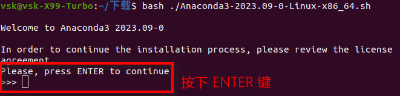

- 一路回车到底会看见是否接受条款的选项，输入 yes 即可
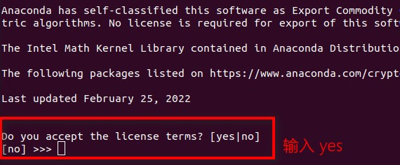

- 之后会问安装 Anaconda3 到哪个位置，默认的位置即可，按下 `Enter` 键继续
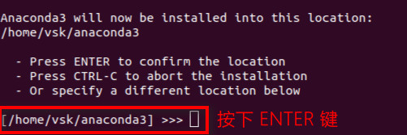

- 安装完成后，会询问是否将 Anaconda3 在终端启动的时候自动切换到 `base` 环境，输入 yes 即可
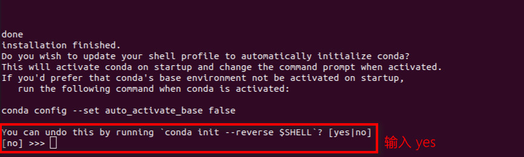

关闭并重新进入终端，此时应看到输入行的最左端出现了 `(base)` 字样，表示当前环境为 `base` 环境，即 Anaconda 安装完成
```bash {.line-numbers}
(base) vsk@vsk-X99-Turbo:~$ 
```

### 搭建 YOLO 环境

#### 1. <span id="jump"></span>查看环境
进入终端或 cmd，输入以下命令来查看环境
```bash {.line-numbers}
conda env list # 查看 Anaconda 环境
```
此时应只存在 `base` 环境：
```bash {.line-numbers}
# conda environments:
#
base                    /Users/Stewart222b/anaconda3
```

#### 2. 创建新环境
使用以下命令创建一个名为 `yolo` 的环境，python 版本为 3.8
```bash {.line-numbers}
conda create -n yolo python=3.8 # 创建 python 版本为 3.8 的环境
```
再次查看环境，此时应新增一个 `yolo` 环境：
```bash {.line-numbers}
# conda environments:
#
base                    /Users/Stewart222b/anaconda3
yolo                    /Users/Stewart222b/anaconda3/envs/yolo
```
#### 3. 切换到 `yolo` 环境
```bash {.line-numbers}
conda activate yolo # 切换到 yolo 环境
```
执行完毕后，命令输入行左侧应出现 `(yolo)`：
```bash {.line-numbers}
(yolo) Stewart222b@This-MacBook-Pro ~ % # terminal
(yolo) C:\Projects> # cmd
```
#### 4. 退出环境
```bash {.line-numbers}
conda deactivate yolo # 退出 yolo 环境
```

### 配置 YOLOv5
#### 1. 下载
从 GitHub [下载](https://github.com/ultralytics/yolov5) 源码或使用 `git clone`
```bash {.line-numbers}
git clone https://github.com/ultralytics/yolov5.git
```

#### 2. 安装
进入下载的 `yolov5` 源码文件夹，在 `yolo` 环境下安装所需要的库
```bash {.line-numbers}
conda activate yolo
cd D:/Projects/yolo/yolov5/ # 根据自己的文件夹位置来修改
pip install -r requirements.txt
```
如果网速过慢，可使用镜像源来进行安装
```bash {.line-numbers}
pip install -r requirements.txt -i https://pypi.tuna.tsinghua.edu.cn/simple # 这里使用的清华源
```
#### 3. 测试
##### 测试 GPU 是否可用
```bash {.line-numbers}
conda activate yolo
python
>>import torch
>>print(torch.cuda.is_available())
```
如果输出 `True` 则说明可用，否则请检查是否安装的是 CPU 版本的 pytorch
```bash {.line-numbers}
conda activate yolo
python
>>import torch
>>print(torch.__version__)
```
如果输出 `torch+cpu` 则说明安装的 CPU 版本的 pytorch，需要重新安装 GPU 版本的 pytorch

##### 测试 `train.py` 是否可用
输入以下命令来测试 YOLOv5 模型训练
```bash {.line-numbers}
python train.py --epoch 1
```
然后 YOLOv5 会下载 COCO128 数据集，相应的字体文件 `Arial.ttf` 和权重模型文件 `yolov5s.pt` 并开始训练 1 轮（默认是 100 轮），训练完成后会将结果保存在 `yolov5/runs/train` 文件夹中。

如果下载数据集和相关文件的网速过慢导致下载失败，可在这里 [下载](https://pan.baidu.com/s/1Ndm6VzXAestoNz_FLjnrgw)（提取码：`pvs4`），里面存放了需要的文件和数据集。解压后：
- 将 `datasets` 文件夹放在 `yolov5` 文件夹的同一路径下（不放在文件夹里面）
- Windows 环境下将 `Arials.ttf` 放在 `.../AppData/Roaming/Ultralytics/` 路径下面；Ubuntu 环境下将 `Arials.ttf` 放在 `~/.config/` 路径下面。
- 将 `yolov5s.pt` 放在 `yolov5` 文件夹中，重新运行 `train.py` 即可。

如果训练成功，最后一行应该输出保存位置：
```bash {.line-numbers}
Results saved to runs/train/exp
```

##### 测试 `detect.py` 是否可用

输入以下命令来测试 YOLOv5 图像检测
```bash {.line-numbers}
python detect.py
```
然后 YOLOv5 会对 `data/images` 里面的两张样图进行检测，检测完成后会将结果保存在 `yolov5/runs/detect` 文件夹中。

如果检测成功，最后一行同样会输出保存位置：
```bash {.line-numbers}
Results saved to runs/detect/exp
```

之后就可开始准备数据集了。本文档提供了一个 非机动车项目的 数据集，如果想直接训练模型可以跳转到 [模型训练](#模型训练) 。

---

>
## 数据集准备
以下为官方文档中获得最佳训练结果建议的翻译，如需更准确内容请 [查看原文](https://docs.ultralytics.com/yolov5/tutorials/tips_for_best_training_results/) 。

>### 获得最佳训练效果的建议
>
>📚 本指南解释了如何使用 YOLOv5 生成最好的 mAP 和训练结果 🚀。更新于 2022 年 5 月 25 日。
>
> 绝大多数情况下，**只要数据集足够大且标注准确**，就可以在不改变模型或训练设置的情况下获得良好的训练结果。如果一开始没有得到好的结果，你可以采取一些步骤来改进，但我们强烈建议用户在考虑任何更改之前**先使用所有默认的设置进行训练**。这有助于找到模型性能的下限，并以此为基础发掘需要改进的点。
>
>如果您对您的训练结果有疑问并且希望得到有帮助的回复，**我们建议您提供尽可能多的信息**，包括结果图（训练损失，val 损失，P，R，mAP），PR曲线，混淆矩阵，训练马赛克，测试结果和数据集统计图像，如 labels.png 。所有这些关于训练结果的数据通常都存放在 `yolov5/runs/train/exp` 路径中。
>
>我们在下面为希望获得 YOLOv5 最佳训练结果的用户提供了完整的指南。
>
>### 数据集
>
>- **每类图像数量。** 推荐每个类别的图像数量 **≥ 1500** 张
>- **每类实例数量。** 推荐每个类别的实例（已标注目标）数量 **≥ 10000** 个
>- **图像多样性。** 必须囊括要部署的环境。假设一个模型用于现实世界中，我们推荐使用多种多样的图像来训练，这些多样性由以下因素体现：不同时间、不同季节、不同天气、不同照明、不同角度、不同来源（在线抓取、本地采集、不同相机）。
>- **标注一致性。** 所有图像中所有类别的所有实例都必须做标注。不可以只标注一部分。
>- **标注准确性。** 标注必须紧贴目标。每个目标和它边界框之间不应该有空隙。任何目标都不应该缺少标注。
>- **Label verification.** View `train_batch*.jpg` on train start to verify your labels appear correct, i.e. see [example](https://docs.ultralytics.com/yolov5/tutorials/train_custom_data#local-logging) mosaic.
>- **背景图像。**  背景图像是没有目标的图像，它们被添加到数据集中以减少假阳（False Positive (FP)）。我们建议使用 0-10% 的背景图像来帮助降低 FPs（COCO 数据集有 1000 张背景图像作为参考，占总数的 1%）。背景图像不需要做标注。
>
><a href="https://arxiv.org/abs/1405.0312"></a>
>
>### 模型选择
>
>像 YOLOv5x 和 [YOLOv5x6](https://github.com/ultralytics/yolov5/releases/tag/v5.0) 这样的大型模型几乎在所有情况下都会有更好的训练结果，但是它们有更多的参数，训练的时候需要更多的 CUDA 内存，并且有较慢的运行速度。对于**移动端**部署，我们推荐使用 YOLOv5s/m 。对于**云端**部署，我们推荐使用 YOLOv5l/x 。有关所有模型的完整比较，请参阅 README [表格](https://github.com/ultralytics/yolov5#pretrained-checkpoints) 。
>
><p align="center"></p>
>
>- **使用预训练的模型权重开始训练。** 推荐用于中小型数据集（如 [VOC](https://github.com/ultralytics/yolov5/blob/master/data/VOC.yaml), [VisDrone](https://github.com/ultralytics/yolov5/blob/master/data/VisDrone.yaml), [GlobalWheat](https://github.com/ultralytics/yolov5/blob/master/data/GlobalWheat2020.yaml)）。将模型的名称传递给 `--weights` 参数。如果权重模型不在 `cwd` 中将自动从 [最新的 YOLOv5 版本](https://github.com/ultralytics/yolov5/releases) 下载。
>
>```shell
>python train.py --data custom.yaml --weights yolov5s.pt
>                                             yolov5m.pt
>                                             yolov5l.pt
>                                             yolov5x.pt
>                                             custom_pretrained.pt
>```
>
>- **从零开始（不使用模型权重开始训练）。** 推荐用于大型数据集（如 [COCO](https://github.com/ultralytics/yolov5/blob/master/data/coco.yaml)，[Objects365](https://github.com/ultralytics/yolov5/blob/master/data/Objects365.yaml)，[OIv6](https://storage.googleapis.com/openimages/web/index.html)）。 传递你感兴趣的模型架构 `yaml` 文件，以及一个空的权重参数 `--weights ''`：
>
>```bash
>python train.py --data custom.yaml --weights '' --cfg yolov5s.yaml
>                                                      yolov5m.yaml
>                                                      yolov5l.yaml
>                                                      yolov5x.yaml
>```
>
>### 训练设置
>
>在修改任何内容之前，**首先使用默认设置进行训练**，以找到模型性能的基准线。[train.py](https://github.com/ultralytics/yolov5/blob/master/train.py) 设置的完整列表可以在 train.py 参数解析器中找到。
>
>- **轮数（Epoch）。** 从 300 轮开始训练。如果过拟合（overfitting）出现较早，则可以减少epoch。如果在 300 轮之后没有出现过拟合，那么就训练更长的时间，比如 600 轮、1200 轮等。
>- **图像大小（Image size）。** 虽然 COCO 数据集中有大量的小对象并且可以从更高分辨率（如 `--img 1280`）的训练中受益，但是 COCO 还是以 `--img 640` 的原生分辨率进行训练（注：可能为了训练速度，YOLOv5 训练使用的 COCO2017 有超过 14 万张有标注的图片）。如果您的数据集中有许多小目标，那么使用更高分辨率的训练将会产生更好的训练结果。如果您在 `--img 1280` 分辨率下进行训练，那么您也应该在 `--img 1280` 下进行测试和检测。使用相同的分辨率才能获得最佳的推理结果。
>- **批次大小（Batch size）。** 请使用硬件允许的最大 `--batch-size` 。小批量训练会产生较差的批量统计数据（batchnorm statistics），应该避免。
>- **超参数（Hyperparameters）。** 默认的超参数在 [hyp.scratch-low.yaml](https://github.com/ultralytics/yolov5/blob/master/data/hyps/hyp.scratch-low.yaml) 中。我们建议您在考虑修改任何默认超参数之前先使用默认超参数进行训练。通常，增加增强超参数（augmentation hyperparameter）将减少和延迟过拟合，从而允许更长的训练时间和更高的最终mAP。减少损失分量增益超参数（loss component gain hyperparameters）（如 `hyp['obj']`）将有助于减少这些特定损失分量的过拟合。有关优化这些超参数的自动化方法，请参阅我们的 [超参数进化教程](https://docs.ultralytics.com/yolov5/tutorials/hyperparameter_evolution).
>
>### 延伸阅读
>
>如果你想了解更多，Karpathy 的 'Recipe for Training Neural Networks' 是一个很好的开始，其中有很好的训练想法，广泛应用于所有 ML 领域：[http://karpathy.github.io/2019/04/25/recipe/](http://karpathy.github.io/2019/04/25/recipe/)
>
>祝你好运🍀，如果你有任何其他问题请联系我们！


### 1. 获取数据
通常由客户提供数据。  

### 2. 确定类别
#### 给定类别：
以 `非机动车项目` 为例，客户要求识别出非机动车并判断是否停放在禁停位置。因非机动车多为两轮车，故将自行车、电瓶车等合并为 `bicycle` 类，共 `1` 类。
#### 边标注边增加类别：
以 `狩猎相机项目` 为例，客户的部分要求为识别出数种动物。因无法确定有多少种动物，故在标注开始时设置几个客户要求的动物类别，并在标注过程中添加出现的动物类别，共 `22` 类。
#### 浏览整个数据集后根据内容确定类别：
当数据集较小时可以使用，如 1000 张以内的数据集。

### 3. 分配数据
整个数据集**随机**分为**训练集**和**验证集**，数据充足的情况可增加一个**测试集**用来测试。

- 训练集和验证集的比例**建议为 9:1 或者 8:2**
- 训练集文件夹名字通常为 `train`
- 验证集文件名字通常为 `val`
- `train` 和 `val` 文件夹下各有两个文件夹：`images` 和 `labels`

格式样例：
```
# xxx_dataset
# ├── train
# |     └── images
# |     └── labels
# └── val
#       └── images
#       └── labels
```
:warning:：格式不对 YOLO 不能正确检测到**图像文件**和其对应**标注文件**

### 4. 标注标准
一些标注数据的标准。
#### 标注边框必须大于目标边界：
- `青岛地铁项目` 中的错误标注：

上图中共标注两个类别 `person`（人）和 `helmet`（头盔）。标注问题：其中左一人物的 `person` 的标注边框并未将伸出去的手臂包括在内。这样标注会导致训练出的模型在人物做出动作时仍只识别其躯干。  
正确标注：

- `狩猎相机项目` 中的错误标注：
  
上图中共标注了一个类别 `deer`（鹿）。标注问题：标注边框并未将鹿的角包括在内。这样标注会导致训练出的模型在识别鹿的时候忽略鹿角。
正确标注：
  

#### 尽量标注每张图中所有的目标：
在类别很少但是目标很密集或很难辨识的情况（如 `非机动车项目` 只有 1 个 `bicycle` 类）下，也必须尽量标注出所有的目标，即使很多目标被大幅度遮挡，也要标注出来，否则识别效果不理想。
- `非机动车项目` 例图

第一版模型标注示例：
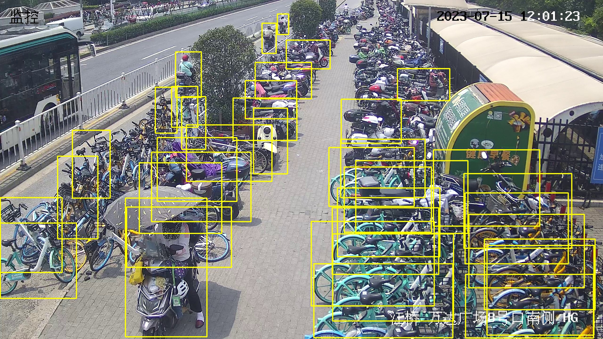
第一版模型识别结果：

第二版模型标注示例：
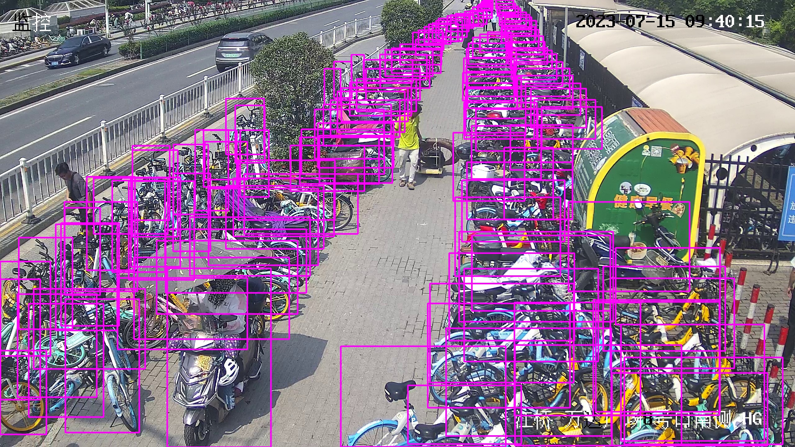
第二版模型识别结果：


在类别很多但是目标很密集或者很难辨识的情况（如 `狩猎相机项目` 有 22 个类别）下，可考虑放弃标注一些辨识度很低的目标。这样做可有效降低假阳（False Positive）率和误识率。
- `狩猎相机项目` 例图
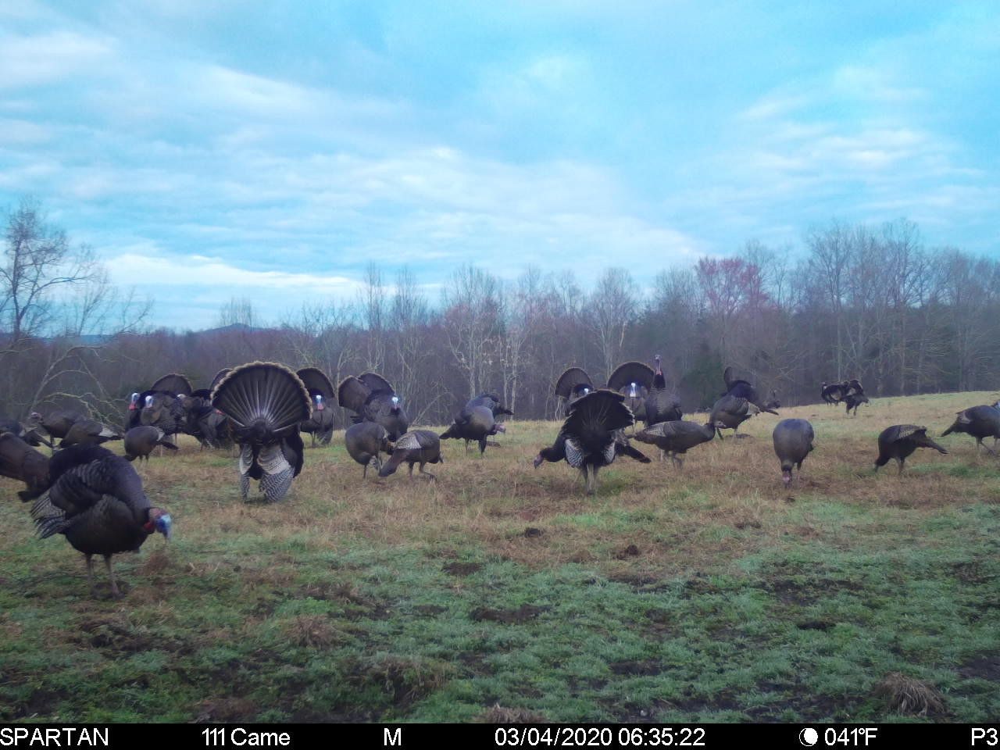
上面这张图全部都是辨识度很高的 `Turkey`（火鸡）类，因此标注时候可以全部标注。
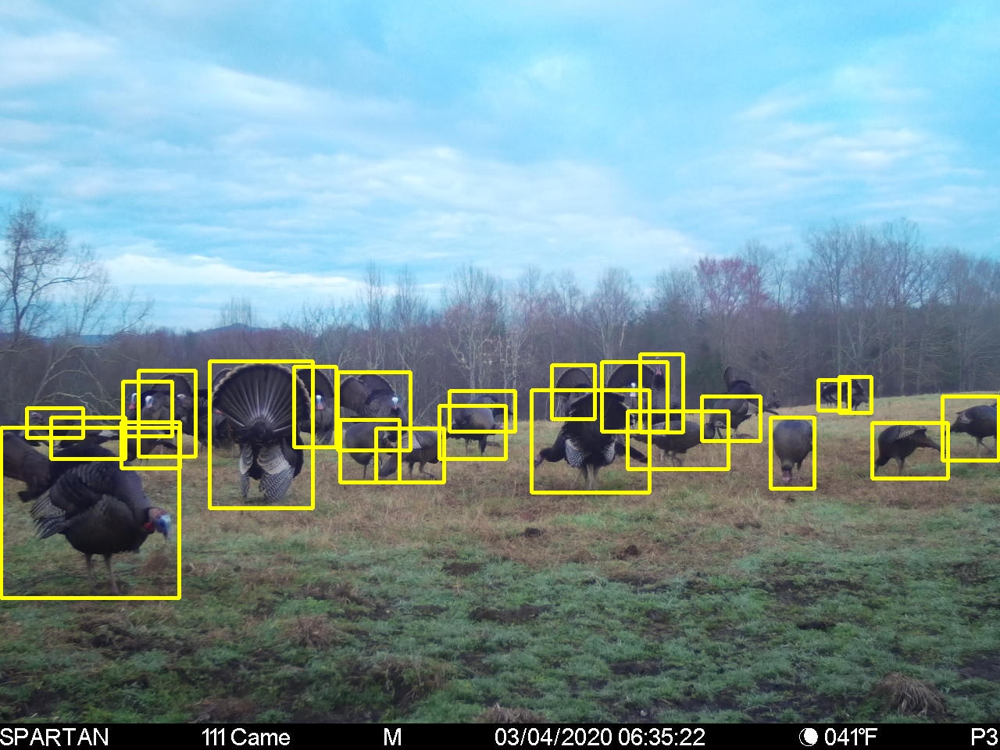
而像下面这张图虽然也全部是火鸡，但红框部分中的火鸡辨识度很低。
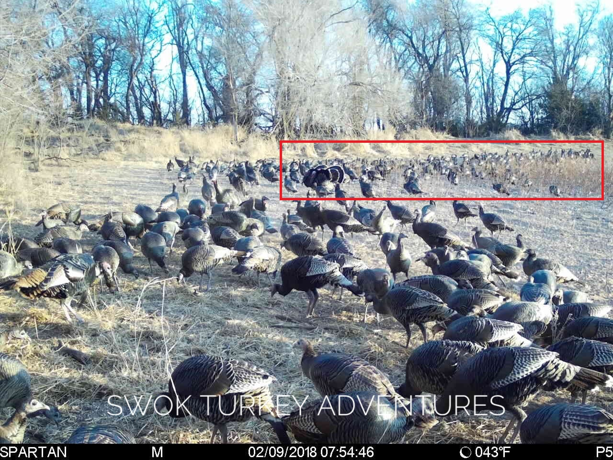
人类能辨识出后面是火鸡是因为我们可以直接接收整张图片的信息，并由前面的火鸡来推断出这是一个火鸡群。YOLO 虽然是 one-stage 算法，但是其在检测的时候也是把图像分成数十个小区域。在 YOLO 看来，这张图片的红框部分可能是这样的：
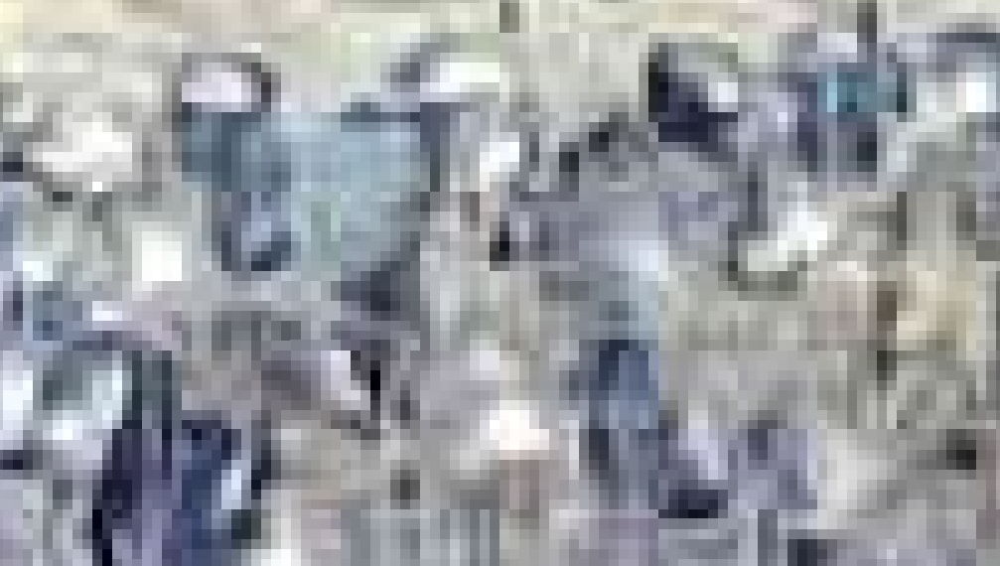
与 `非机动车项目` 不同，`狩猎相机项目` 有很多类别，如果把这种特征模糊辨识度低的实例放入 `Turkey` 类，可能会使模型将背景识别成火鸡（许多场景在复杂的森林中），也可能会将许多别的动物（如 `Bird`（鸟）类和 `Eagle`（鹰）类）误识别成火鸡。因此标注的时候并未标注出后方火鸡。


#### 被遮挡目标用统一的标注方法：
- `青岛地铁项目` 例图：

第一种标注：

第二种标注：

上两图中共标注两个类别 `person`（人）和 `helmet`（头盔）。两张图片的标注区别主要在于右一人物的 `person` 类标注的位置。第一张图只标注了人物未被遮挡的部分，而第二张图则同时标注了人物未被遮挡和被遮挡的部分。**这两种标注方法都没问题，但在一个数据集中须只采用一种方法而不能多种方法来回使用**。
### 5. 标注数据
可在线标注或使用标注工具 labelImg 进行标注。
#### 在线标注：
YOLO 官方推荐的标注平台：[Roboflow](https://roboflow.com/annotate)

#### labelImg 标注：

labelImg 是一个用于图像标注的跨平台工具，支持 Windows、macOS 和 Linux。

labelImg 官网 [下载](https://github.com/HumanSignal/labelImg)

教程：[LabelImg（目标检测标注工具）的安装与使用教程](https://blog.csdn.net/knighthood2001/article/details/125883343)

### 6. 校验数据
YOLO 官方建议每个类别有超过 **1000** 个实例，但实际情况根据数据集大小来决定。最重要的是**保证每个类别都有足够的多种多样的实例**。

#### 检查每个类别实例（标签）数量
```python {.line-numbers}
import os
# 类别
#classes = open(os.path.dirname(__file__) + "/classes.txt", mode='r').read().rstrip("\n").split("\n") # 获取数据集类别
classes = ['Human',
        'Vehicle',
        'License plate',
        'Deer',
        'Antler',
        'Turkey',
        'Eagle',
        'Hog',
        'Bird',
        'Bear',
        'Raccoon',
        'Lynx',
        'Wolf',
        'Fox',
        'Dog',
        'Goat',
        'Tiger',
        'Squirrel',
        'Groundhog',
        'Cattle',
        'Rabbit',
        'Armadillo']
num_class = len(classes)
# 路径
path = 'C:/Projects/hunt_camera/dataset_10_16/train/labels/'
# 文件列表
files = []
for file in os.listdir(path):
    if file.endswith(".txt"):
        files.append(path+file)
# 逐文件读取
inst_count = [0 for _ in range(num_class)]
file_count = 0
for file in files:
    with open(file, 'r') as f:
        data = f.read()
        instances = data.strip("\n").split("\n") if len(data) > 0 else "" # 获取所有样本并归类
        if len(instances) <= 0:
            continue
        else:
            file_count += 1
        
        for instance in instances:
            inst_count[int(instance.split()[0])] += 1
# 输出统计结果
print("统计完成！\n    该数据集共有 " + str(num_class) + " 类\n    一共有 " + str(file_count) + " 张有实例的图片")
print("输出格式：[class: number of instances]")
result = {}
for i in range(num_class):
    result[classes[i]] = inst_count[i]
result = sorted(result.items(), key=lambda x:x[1], reverse=True)
bad_class = []
for res in result:
    print("    " + res[0] + ": " + str(res[1]))
    if res[1] < 50: bad_class.append(res[0])

print("！以下类别实例过少，建议提升实例数量\n    ", end="")
print(bad_class)
```
上面代码统计了 `狩猎相机项目` 训练集各个类别的实例数量，输出如下
```bash {.line-numbers}
统计完成！
    该数据集共有 22 类
    一共有 4598 张有样本的图片
输出格式：[class: number of instances]
    Deer: 3837
    Antler: 1499
    Turkey: 800
    Bird: 284
    Raccoon: 270
    Goat: 262
    Human: 239
    Hog: 209
    Lynx: 185
    Cattle: 179
    Fox: 144
    Wolf: 142
    Vehicle: 122
    Dog: 121
    Eagle: 117
    Bear: 110
    Armadillo: 94
    Squirrel: 93
    Rabbit: 74
    Groundhog: 58
    Tiger: 55
    License plate: 8
！以下类别实例过少，建议提升实例数量
    ['License plate']
```
设定的警告值为小于 50 ，数据集中的 `License plate` （车牌）类别被警告实例数量过少。

### 7. 增加数据
可通过不同方法增加数据来提升模型的识别精度和广度，尤其对于实例很少的类别。

#### 客户提供：
如果客户可提供更多样的数据，对模型识别的精度和广度有很大提升。
- 以 `青岛地铁项目` 为例，一开始并没有类别 `train`（列车）的数据导致识别效果很差。但随着地铁试运行后获得很多新数据，使得模型对 `train` 的识别精度提升很大。

#### 网络搜索：
如客户不能提供更多数据，可在网络上搜索新的数据。
- 以 `非机动车项目` 为例，数据集中有非常多的堆叠自行车，但却几乎没有完整/不被遮挡的自行车，因此需要自行添加一些高质量的自行车图像。

#### 数据增强（Data Augmentation）：
**定义**：数据增强也叫数据扩增，意思是在不实质性的增加数据的情况下，让有限的数据产生等价于更多数据的价值

关于数据增强的介绍:[【机器学习】数据增强(Data Augmentation)](https://blog.csdn.net/u010801994/article/details/81914716)

虽然数据增强通常可以借助现有数据产生许多新的数据，但在 YOLOv5 中，数据增强是在训练过程中进行的，不产生实质性的新数据，因此需在训练之前调整相关函数或直接在训练时修改关于数据增强的超参数。

**修改代码来调整数据增强**：[YOLOv5 使用的数据增强方法汇总](https://blog.csdn.net/weixin_44751294/article/details/126211751)

**修改超参数（Hyperparameter）来调整数据增强**：  
yolov5 在训练的时候 `--hyp` 参数默认调用 `hyp.scratch-low.yaml` 超参数文件：
```python {.line-numbers}
parser.add_argument('--hyp', type=str, default=ROOT / 'data/hyps/hyp.scratch-low.yaml', help='hyperparameters path')
```
具体参数：
```python{.line-numbers}
lr0: 0.01  # 初始学习率 (SGD=1E-2, Adam=1E-3)
lrf: 0.01  # 循环学习率 (lr0 * lrf)
momentum: 0.937  # SGD momentum/Adam beta1 学习率动量
weight_decay: 0.0005  # 权重衰减系数 
warmup_epochs: 3.0  # 预热学习 (fractions ok)
warmup_momentum: 0.8  # 预热学习动量
warmup_bias_lr: 0.1  # 预热初始学习率
box: 0.05  # iou损失系数
cls: 0.5  # cls损失系数
cls_pw: 1.0  # cls BCELoss正样本权重
obj: 1.0  # 有无物体系数(scale with pixels)
obj_pw: 1.0  # 有无物体BCELoss正样本权重
iou_t: 0.20  # IoU训练时的阈值
anchor_t: 4.0  # anchor的长宽比（长:宽 = 4:1）
# anchors: 3  # 每个输出层的anchors数量(0 to ignore)
#以下系数是数据增强系数，包括颜色空间和图片空间
fl_gamma: 0.0  # focal loss gamma (efficientDet default gamma=1.5)
hsv_h: 0.015  # 色调 (fraction)
hsv_s: 0.7  # 饱和度 (fraction)
hsv_v: 0.4  # 亮度 (fraction)
degrees: 0.0  # 旋转角度 (+/- deg)
translate: 0.1  # 平移(+/- fraction)
scale: 0.5  # 图像缩放 (+/- gain)
shear: 0.0  # 图像剪切 (+/- deg)
perspective: 0.0  # 透明度 (+/- fraction), range 0-0.001
flipud: 0.0  # 进行上下翻转概率 (probability)
fliplr: 0.5  # 进行左右翻转概率 (probability)
mosaic: 1.0  # 进行Mosaic概率 (probability)
mixup: 0.0  # 进行图像混叠概率（即，多张图像重叠在一起） (probability)
copy: 0.0 # 进行分割复制粘贴（需要 segments 数据才可用）（probability）
```
yolov5 的数据增强是大部分是随机调用的，可以通过调整参数或自定义一个新的超参数文件来提高或降低调用概率。

---

## 模型训练

`非机动车项目` 数据集在这里 [下载](https://www.alipan.com/s/kXZrhqAD2Hn)（提取码：`lb28`）

数据集内容：上海江桥地铁口录像
- 训练集 (train)：`880` 张图像，其中 `24` 张为**负样本**（即背景，不包含检测目标的图像）
- 验证集 (val)：`131` 张图像，其中 `6` 张为负样本

类别有 `1` 类：`Non-motor vehicle`（非机动车）


### 本地训练
- 以提供的 `非机动车项目` 数据集在 Ubuntu 20.04 环境中为例，如果没有 `yolov5` 所在路径没有 `datasets` 文件夹，则需要先创建，位置如图所示：
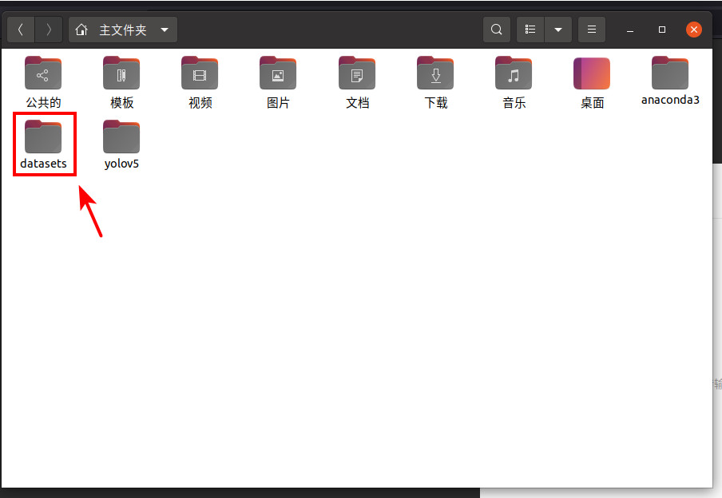
- 将数据集中的 `bicycle` 文件夹放到 `datasets` 文件夹中，里面还存放着先前测试 `train.py` 时下载的 `coco128` 数据集：
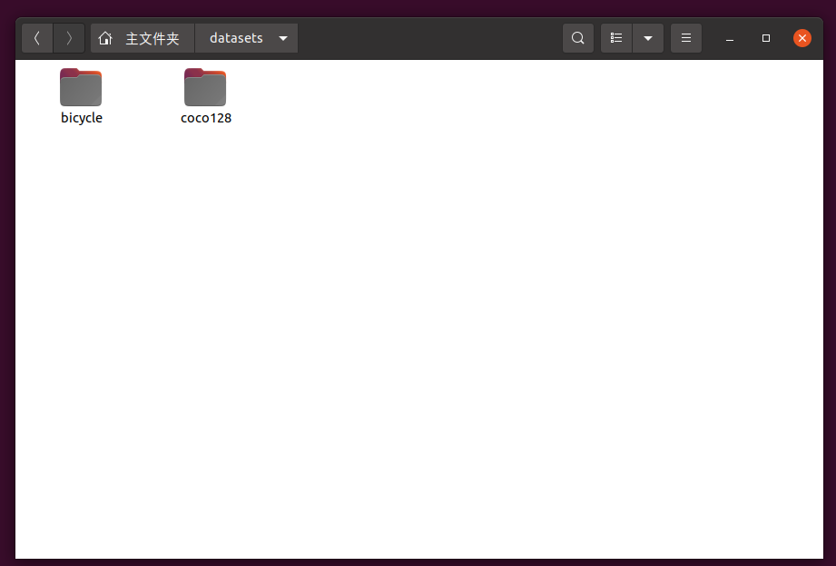
- 进入 `yolov5/data` 文件夹，创建一个名为 `bicycle.yaml` 的文件，内容如下：
    ```python{.line-numbers}
    # train and val data as 1) directory: path/images/, 2) file: path/images.txt, or 3) list: [path1/images/, path2/images/]
    train: ../datasets/bicycle/train/images/
    val: ../datasets/bicycle/val/images/
    # test: ../datasets/yolo_A/images/
    # number of classes
    nc: 1

    # class names
    names: ['bicycle']
    ```
- 打开终端，切换到 `yolo` 环境，路径转到 `yolov5` 文件夹下
    ```bash{.line-numbers}
    conda activate yolo
    cd ~/yolov5 # 位置修改一下
    ```
    基础训练命令：
    ```bash
    python train.py --batch -1 --epoch 200 --weights yolov5s.pt --data ./data/bicycle.yaml
    ```
    `--batch`：每一批训练的图片数量，`-1` 代表自动设置显卡能承受的最大的的 `batch size`。   
    `--epoch`：训练轮数。  
    `--weights` ：训练权重。权重模型越大，训练速度越慢，训练出的模型也越大，识别精度也越高。  
    `--data`：训练数据。内容为 `.yaml` 格式的文件

- 训练开始之前，YOLO 会做一些准备并且读取分析数据，界面会变成如下所示：
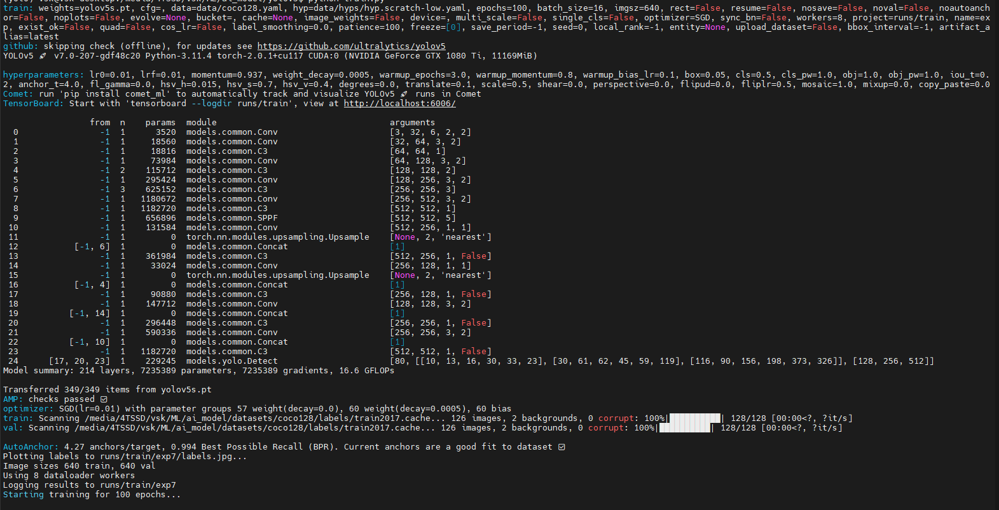

- 如果没有报错，准备完成后会开始模型的训练。每一轮结束后都会更新训练的结果：
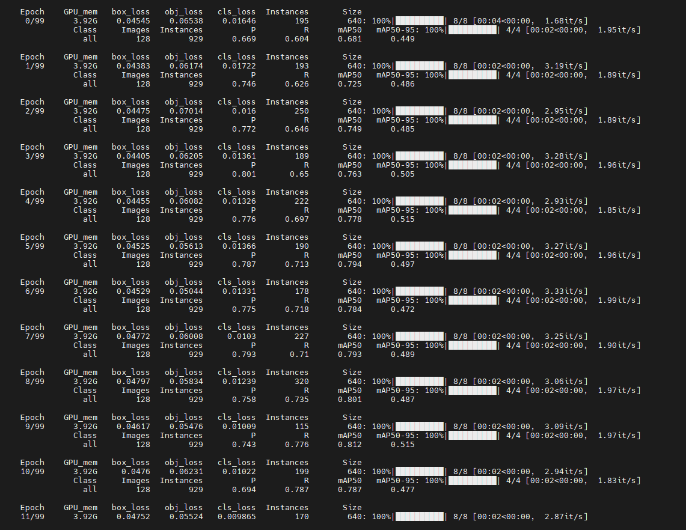

`train.py` 中的所有参数
```python {.line-numbers}
def parse_opt(known=False):
    parser = argparse.ArgumentParser()
    parser.add_argument('--weights', type=str, default=ROOT / 'yolov5s.pt', help='initial weights path')
    parser.add_argument('--cfg', type=str, default='', help='model.yaml path')
    parser.add_argument('--data', type=str, default=ROOT / 'data/coco128.yaml', help='dataset.yaml path')
    parser.add_argument('--hyp', type=str, default=ROOT / 'data/hyps/hyp.scratch-low.yaml', help='hyperparameters path')
    parser.add_argument('--epochs', type=int, default=100, help='total training epochs')
    parser.add_argument('--batch-size', type=int, default=16, help='total batch size for all GPUs, -1 for autobatch')
    parser.add_argument('--imgsz', '--img', '--img-size', type=int, default=640, help='train, val image size (pixels)')
    parser.add_argument('--rect', action='store_true', help='rectangular training')
    parser.add_argument('--resume', nargs='?', const=True, default=False, help='resume most recent training')
    parser.add_argument('--nosave', action='store_true', help='only save final checkpoint')
    parser.add_argument('--noval', action='store_true', help='only validate final epoch')
    parser.add_argument('--noautoanchor', action='store_true', help='disable AutoAnchor')
    parser.add_argument('--noplots', action='store_true', help='save no plot files')
    parser.add_argument('--evolve', type=int, nargs='?', const=300, help='evolve hyperparameters for x generations')
    parser.add_argument('--bucket', type=str, default='', help='gsutil bucket')
    parser.add_argument('--cache', type=str, nargs='?', const='ram', help='image --cache ram/disk')
    parser.add_argument('--image-weights', action='store_true', help='use weighted image selection for training')
    parser.add_argument('--device', default='', help='cuda device, i.e. 0 or 0,1,2,3 or cpu')
    parser.add_argument('--multi-scale', action='store_true', help='vary img-size +/- 50%%')
    parser.add_argument('--single-cls', action='store_true', help='train multi-class data as single-class')
    parser.add_argument('--optimizer', type=str, choices=['SGD', 'Adam', 'AdamW'], default='SGD', help='optimizer')
    parser.add_argument('--sync-bn', action='store_true', help='use SyncBatchNorm, only available in DDP mode')
    parser.add_argument('--workers', type=int, default=8, help='max dataloader workers (per RANK in DDP mode)')
    parser.add_argument('--project', default=ROOT / 'runs/train', help='save to project/name')
    parser.add_argument('--name', default='exp', help='save to project/name')
    parser.add_argument('--exist-ok', action='store_true', help='existing project/name ok, do not increment')
    parser.add_argument('--quad', action='store_true', help='quad dataloader')
    parser.add_argument('--cos-lr', action='store_true', help='cosine LR scheduler')
    parser.add_argument('--label-smoothing', type=float, default=0.0, help='Label smoothing epsilon')
    parser.add_argument('--patience', type=int, default=100, help='EarlyStopping patience (epochs without improvement)')
    parser.add_argument('--freeze', nargs='+', type=int, default=[0], help='Freeze layers: backbone=10, first3=0 1 2')
    parser.add_argument('--save-period', type=int, default=-1, help='Save checkpoint every x epochs (disabled if < 1)')
    parser.add_argument('--seed', type=int, default=0, help='Global training seed')
    parser.add_argument('--local_rank', type=int, default=-1, help='Automatic DDP Multi-GPU argument, do not modify')

    # Logger arguments
    parser.add_argument('--entity', default=None, help='Entity')
    parser.add_argument('--upload_dataset', nargs='?', const=True, default=False, help='Upload data, "val" option')
    parser.add_argument('--bbox_interval', type=int, default=-1, help='Set bounding-box image logging interval')
    parser.add_argument('--artifact_alias', type=str, default='latest', help='Version of dataset artifact to use')

    return parser.parse_known_args()[0] if known else parser.parse_args()
```
在训练更复杂更庞大的模型的时候需要用到更多的参数，这些参数可以通过命令行来指定，也可以通过配置文件来指定。

### 线上训练
除了在自己的设备上训练，也可以在服务器上来训练模型。
- 优点：
    - 速度快：服务器上的显卡大多性能强大、算力高，如 RTX4090 等。
    - 不占资源：线上训练不影响本地设备的性能。
- 缺点：
    - 收费：需要花钱租用显卡，费用大概几块钱一小时。
    - 时间受限：在高峰期可能出现没有显卡的情况。

平台：[AutoDL算力云](https://www.autodl.com/home)  
教程：[快速开始](https://www.autodl.com/docs/quick_start/)

### 训练结果

**位置**  
如果未在训练时指定 `--project` 参数和 `--name` 参数，训练结束后结果将保存在 `yolov5/runs/train/` 路径下。里面有一个 `weights` 文件夹存放着`best.pt` 和 `last.pt` 两个训练后得到的模型。`last.pt` 是最后一轮训练完的模型，`best.pt` 的评判标准官方文档没有写，但 `train.py` 中的源码显示是按照 `P`，`R`，`mAP@0.5`，`mAP@0.5:0.95` 四个属性的权重来算的。通常在用训练模型做检测的时候会优先使用 `best.pt` 模型。

**分析**  
除了 `weights` 文件夹，还有其他关于训练结果的文件。  
结果解析：[yolov5训练结果解析
](https://blog.csdn.net/XiaoGShou/article/details/118274900)

---

## 模型检测
打开终端或 cmd，切换到 `yolo` 环境，路径转到 `yolov5` 文件夹下
```bash{.line-numbers}
conda activate yolo
cd ~/yolov5 # 位置修改一下
```
基础检测命令：
```bash
python detect.py --weights ./runs/train/exp/weights/best.pt --source ../test.jpg --save-txt
```
`--weights` 参数指定用来检测的模型，内容为训练好的模型。  
`--source` 参数指定需要检测的数据，可以是单张图像、单个视频，也可以是一个存放图像和视频的目录。  
`--save-txt` 参数用于生成检测结果的 `.txt` 标注文件，文件格式和训练模型用的标注一样。

`detect.py` 中的所有参数
```python{.line-numbers}
def parse_opt():
    parser = argparse.ArgumentParser()
    parser.add_argument('--weights', nargs='+', type=str, default=ROOT / 'yolov5s.pt', help='model path or triton URL')
    parser.add_argument('--source', type=str, default=ROOT / 'data/images', help='file/dir/URL/glob/screen/0(webcam)')
    parser.add_argument('--data', type=str, default=ROOT / 'data/coco128.yaml', help='(optional) dataset.yaml path')
    parser.add_argument('--imgsz', '--img', '--img-size', nargs='+', type=int, default=[640,640], help='inference size h,w')
    parser.add_argument('--conf-thres', type=float, default=0.25, help='confidence threshold')
    parser.add_argument('--iou-thres', type=float, default=0.45, help='NMS IoU threshold')
    parser.add_argument('--max-det', type=int, default=1000, help='maximum detections per image')
    parser.add_argument('--device', default='', help='cuda device, i.e. 0 or 0,1,2,3 or cpu')
    parser.add_argument('--view-img', action='store_true', help='show results')
    parser.add_argument('--save-txt', action='store_true', help='save results to *.txt')
    parser.add_argument('--save-conf', action='store_true', help='save confidences in --save-txt labels')
    parser.add_argument('--save-crop', action='store_true', help='save cropped prediction boxes')
    parser.add_argument('--nosave', action='store_true', help='do not save images/videos')
    parser.add_argument('--classes', nargs='+', type=int, help='filter by class: --classes 0, or --classes 0 2 3')
    parser.add_argument('--agnostic-nms', action='store_true', help='class-agnostic NMS')
    parser.add_argument('--augment', action='store_true', help='augmented inference')
    parser.add_argument('--visualize', action='store_true', help='visualize features')
    parser.add_argument('--update', action='store_true', help='update all models')
    parser.add_argument('--project', default=ROOT / 'runs/detect', help='save results to project/name')
    parser.add_argument('--name', default='exp', help='save results to project/name')
    parser.add_argument('--exist-ok', action='store_true', help='existing project/name ok, do not increment')
    parser.add_argument('--line-thickness', default=3, type=int, help='bounding box thickness (pixels)')
    parser.add_argument('--hide-labels', default=False, action='store_true', help='hide labels')
    parser.add_argument('--hide-conf', default=False, action='store_true', help='hide confidences')
    parser.add_argument('--half', action='store_true', help='use FP16 half-precision inference')
    parser.add_argument('--dnn', action='store_true', help='use OpenCV DNN for ONNX inference')
    parser.add_argument('--vid-stride', type=int, default=1, help='video frame-rate stride')
    opt = parser.parse_args()
    opt.imgsz *= 2 if len(opt.imgsz) == 1 else 1  # expand
    print_args(vars(opt))
    return opt
```
### 检测结果

如果未在检测时指定 `--project` 参数和 `--name` 参数，训练结果将保存在 `yolov5/runs/detect/` 路径下，里面会放着检测结果的图片和视频。模型会将检测到的目标用方框标记出来，并在方框中显示检测到的目标类别。目标类别旁边的数字是检测到的目标置信度，代表模型认为检测到的目标有多大的可能性是该类别。
例子：
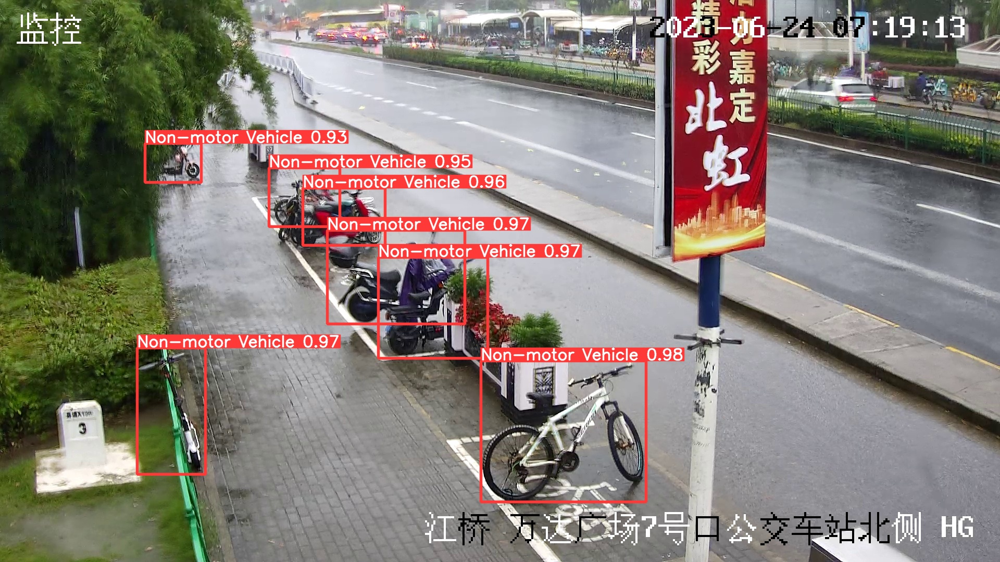

---

## 模型量化

### 模型导出
`.pt` 格式导出为 `.onnx` 格式
```bash{.line-numbers}
python export.py --weights ./nret/qd-subway-yolov5m-v36/weights/best.pt --include onnx --device 0 --opset 12
```
`--weights` 参数替换成自己的模型
### 模型查看
使用 NETRON 可查看 `.onnx`，`.caffe` 等格式的模型结构。
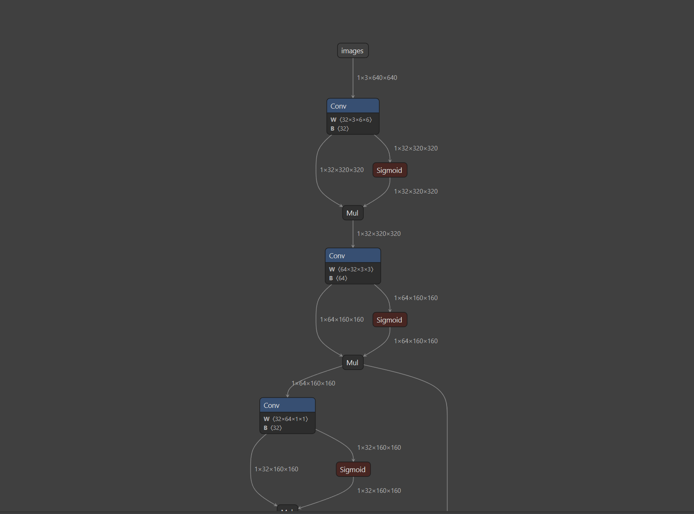
NETRON：https://netron.app

### 量化工具
使用对应量化工具来量化模型。

Rocketchip，Hailo 和 Eeasy 分别使用其对应的量化工具来进行模型的转换和量化。

### 模型量化精度对比

### 1. 选择位置

在 `Netron` 上面打开 `.onnx` 模型，可以看到有很多 `Conv` 模块。

yolov5 的 `Conv` 模块：
```python {.line-numbers}
class Conv(nn.Module):
    def __init__(self, c1, c2, k=1, s=1, p=None, g=1, act=True):
                # ch_in, ch_out, kernel, stride, padding, groups
        super(Conv, self).__init__()
        self.conv = nn.Conv2d(c1, c2, k, s, autopad(k, p), groups=g, bias=False)
        self.bn = nn.BatchNorm2d(c2)
        self.act = nn.Hardswish() if act else nn.Identity()

    def forward(self, x):
        return self.act(self.bn(self.conv(x)))

    def fuseforward(self, x):
        return self.act(self.conv(x))
```
yolov5 已经没有单独的卷积层了，这些都被包含在 `Conv` 模块里，通过源码可以看到其中包含了 `Conv2d`、`BatchNorm2d`、`Hardwish` 的组合。

其中 `Conv2d` 就是卷积层，`BatchNorm2d` 是归一化层，`Hardwish` 是激活函数。（注：不同大小的模型用的是不同的激活函数）

因此，要查看卷积层的输出就要看 `Conv` 模块的输出。

### 2. 获取 `ONNX` 模型输出 

#### 获取 `shape`

首先，我们要想知道每一层的 `shape`，可以先使用 `infer_shapes()` 函数显示出每一层的 `shape`：
```python {.line-numbers}
import onnx
from onnx import shape_inference
path = "hunt_camera_v2_yolov5s.onnx" #the path of your onnx model
onnx.save(onnx.shape_inference.infer_shapes(onnx.load(path)), path)
```

原始 `.onnx` 模型只能看到输入的 `shape`：
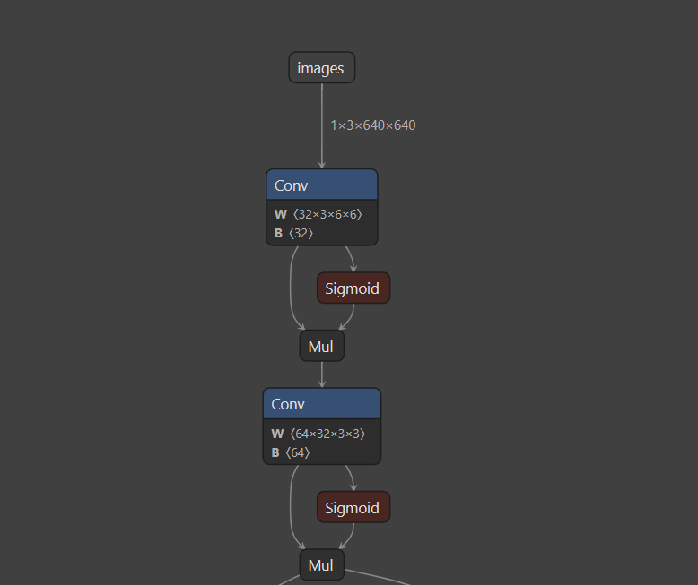

添加完 `shape` 之后在 `Netron` 中查看就可以看到每一个层和模块的形状了：
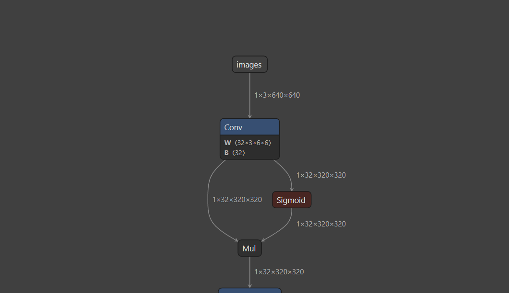

#### 创建 `output`

没找到直接查看 `.onnx` 模型每一个模块的输出的办法，因此使用的是直接修改 `.onnx` 模型的方法。方法是在需要查看的 `Conv` 模块后面中添加一个 `output` 节点，这样就可以在模型接收模型输出的时候输出这个 `output` 节点的结果。

创建 `output` 节点：
```python {.line-numbers}
import onnx
import sys
from onnx import helper, TensorProto
# load model
model = onnx.load_model("hunt_camera_v2_yolov5s.onnx")
new_model_name = "hunt_camera_v2_yolov5s_edited.onnx"
module_name = '/model.0/conv/Conv'

# add output
intermediate_layer_value_info = helper.make_tensor_value_info(module_name + '_output_0', TensorProto.FLOAT, tmp_caffe.shape)
model.graph.output.extend([intermediate_layer_value_info])
onnx.save(model, new_model_name)
onnx.checker.check_model(model)
```

创建 `output` 节点之后，再次使用 `Netron` 查看发现多了一个 `Conv_output_0`：


但是只能通过 `InferenceSession()` 函数运行整个模型来查看 `Conv_output_0` 的结果，不能直接运行到这一层来查看。
```python {.line-numbers}
# run model
import onnxruntime as ort

new_model_name = "hunt_camera_v2_yolov5s_edited.onnx"
ort_session = ort.InferenceSession(new_model_name)
input_name = ort_session.get_inputs()[0].name
output_name = ort_session.get_outputs()[-1].name
print("Model input name: " + input_name)
print("Model output name: " + output_name)
```

### 3. 获取量化后的模型输出

#### 获取 `CAFFE` 模型输出

``` python {.line-numbers}
import caffe

deploy = './hunt_camera_v2_yolov5s_11weight16b_letterbox/deploy_q.prototxt'
model = './hunt_camera_v2_yolov5s_11weight16b_letterbox/deploy_q.caffemodel'

layer_name = layer
#layer_name = '/model.1/conv/Conv'

caffe.set_mode_gpu()
net = caffe.Net(deploy, model, caffe.TEST)
input_name = net.inputs[0]
net.blobs[input_name].reshape(*img_in.shape)
net.blobs[input_name].data[...] = 1.0 * img_in
res = net.forward()

layer_output = net.blobs[layer_name].data
```

`.caffe` 模型在前向传播后即可直接查看任意层和模块的输出，只要有正确的名称即可。这些名称可以参考 `deploy.prototxt` 文件或者查看 `Netron`。

#### 获取 `RKNN` 模型输出

```python {.line-numbers}
from rknn.api import RKNN

# Create RKNN object
rknn = RKNN(verbose=True)

# pre-process config
print('--> Config model')
rknn.config(mean_values=[[0,0,0]],
#std_values=[[255,255,255]],
target_platform='rk3588')
print('done')

print('--> Loading model')
rknn.load_onnx(model=new_model_name)
print('done')
# rknn.config(batch_size=1)
# rknn.init_runtime()

# Build model
print('--> Building model')
rknn.build(do_quantization=False)
print('done')
rknn.export_rknn('./model.rknn')
rknn.init_runtime()
# print('image.shape:', image.shape)
#conf_rknn, boxes_rknn, tmp_rknn = rknn.inference(inputs=[img_rknn])
pred_rknn = rknn.inference(inputs=[img_onnx], data_format='nchw')
tmp_rknn = pred_rknn[-1]
```
`.rknn` 的输出查看方法和`.onnx` 模型类似，需要先修改 `.onnx` 模型然后再转换到 `.rknn` 模型来查看。目前仅能有效查看不量化的 `.rknn` 模型输出，因此 `do_quantization` 设置为 `False`。

还未找到快速的查看量化后的 `.rknn` 模型的方法。

### 4. 模型输出对比

对比代码：
``` python {.line-numbers}
import numpy as np
import onnxruntime as ort

ort_session = ort.InferenceSession(new_model_name)
input_name = ort_session.get_inputs()[0].name
output_name = ort_session.get_outputs()[-1].name
print("Model input name: " + input_name)
print("Model output name: " + output_name)


tmp_onnx; # ONNX 模型输出
tmp_caffe; # CAFFE 模型输出

tmp_onnx = np.squeeze(tmp_onnx)
tmp_caffe = np.squeeze(tmp_caffe)
tmp_onnx = tmp_onnx.reshape(-1,tmp_onnx.shape[-1])
tmp_caffe = tmp_caffe.reshape(-1,tmp_caffe.shape[-1])

# for idx in range(tmp_onnx.shape[0],2):
for idx in range(0,4):
    print('********************* ONNX:%d ****************************' % idx)
    print(tmp_onnx[idx,:20])
    print('********************* CAFFE:%d ****************************' % idx)
    print(tmp_caffe[idx,:20])

difference = np.sum(np.abs(tmp_onnx-tmp_caffe)) # 计算两个模型输出张量的差异
total_weight = np.sum(np.abs(tmp_onnx)) # 计算 ONNX 模型输出张量的和
print('totoal-difference:', difference)
print('totoal-weight:', total_weight)
print('drift-rate: %.4f%%' % (difference/total_weight*100)) # 差异 / 和 * 100 得到差异率
return difference/total_weight*100
```

测试 `/model.24/m.2/Conv` 层运行结果：
```
Model input name: images
Model output name: /model.24/m.2/Conv_output_0
********************* ONNX:0 ****************************
[ 2.0380955  -0.64926183  0.25349885 -0.7876912  -0.68828493 -0.68378574
-0.71489865 -0.6836378  -0.71785384 -0.72170687 -0.7149651  -0.7498944
-0.738917   -0.75762194 -0.74980915 -0.749394   -0.67710674 -1.2237241
0.38467658 -1.9263489 ]
********************* CAFFE:0 ****************************
[ 2.   -0.5  -0.25 -1.25 -0.75 -0.25 -0.75 -0.75 -0.75 -0.5  -0.75 -0.25
-0.25 -0.75 -0.5  -0.75 -0.5  -1.25  0.5  -2.  ]
********************* ONNX:1 ****************************
[ 1.8464661  -0.6614782   0.4983362   0.05329314  0.05828527  0.13097596
0.11110447  0.11521395  0.1272501   0.14217213  0.1303185   0.12556425
0.11870486  0.09002665  0.07062544  0.17548232  0.07286057 -0.65011483
0.61550593 -2.1564612 ]
********************* CAFFE:1 ****************************
[ 1.75 -0.75  0.75 -0.    0.    0.    0.25 -0.    0.    0.25  0.25  0.
-0.    0.25  0.25  0.    0.   -0.25  0.5  -1.25]
********************* ONNX:2 ****************************
[ 1.9916768  -0.7141057   0.897146    0.2966341   0.819836    0.39354512
-0.02427719  0.1300515   0.3129658   0.36364385  0.34432718  0.30698228
0.15846515  0.00796852  0.07667588  0.45316887  0.5310508  -1.0984457
-0.02884804 -2.4522328 ]
********************* CAFFE:2 ****************************
[ 1.25 -0.75  1.25  0.75  1.25  0.25 -0.   -0.25 -0.25  0.5   0.5   0.
-0.5   0.5   0.25  0.    1.   -0.   -1.5  -3.25]
********************* ONNX:3 ****************************
[ 2.00982    -0.6291439   0.5626283   0.3935729   0.5332883   0.5499117
0.37429148  0.40586212  0.40179613  0.26119912  0.32364634  0.36331028
0.33779922  0.29995415  0.26458564  0.46278474  0.14686139 -0.46416113
0.5365127  -2.373597  ]
********************* CAFFE:3 ****************************
[ 1.   -1.    1.   -1.25  0.75 -0.5   0.5   0.   -0.5   0.75 -0.5   0.25
0.25 -1.    0.5  -0.25  0.25  2.25 -0.   -3.25]
totoal-difference: 28496.715
totoal-weight: 103959.42
drift-rate: 27.4114%
``` 

---